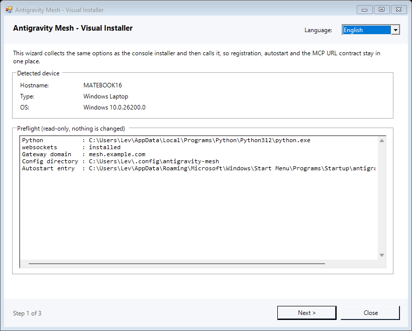
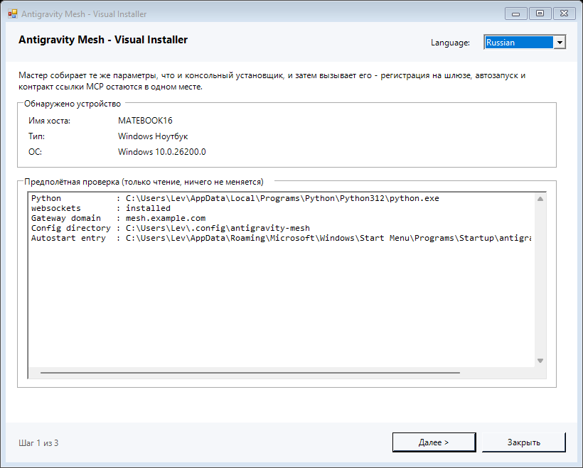

# 📱 Gemini Computer Use — control any PC from Gemini Spark (App & Web)

> **An MCP server that turns Google Gemini from a chatbot into a full-fledged mobile agent.**
> Type a task in the Gemini app on your phone — your PC, laptop or server executes it, and Gemini reports back with real results.

[English](README.md) | [🇷🇺 Русская версия](#-русская-версия)

---

## 💡 The idea

Gemini in a browser or on a phone can talk, but it cannot *do* anything on your computer.
**Gemini Computer Use** closes that gap. It is a free, open-source **Model Context Protocol (MCP)** server that you connect to **Gemini Spark** ([gemini.google.com/spark/apps](https://gemini.google.com/spark/apps) or the Gemini mobile app) with a single link. After that, Gemini gets hands:

- runs shell commands, builds and tests code, manages git;
- reads, writes and edits files;
- searches the file system;
- starts long-running jobs and checks on them later;
- watches CPU, RAM and disk.

```text
 📱 Gemini app / 🌐 gemini.google.com (Spark)
              │  MCP (SSE / Streamable HTTP)
              ▼
     ☁️  Gateway  smart-server.online   ← relay only, TLS
              │  outbound WebSocket tunnel (no open ports)
              ▼
   💻 Your PC · laptop · VPS · home server  →  executes the task
```

**Result:** your phone becomes a remote control for every machine you own — and Gemini is the agent that operates them.

---

## 🔥 What you can do with it

Just ask Gemini in plain language, from anywhere:

- *"Check why my home server is slow and show the top processes"*
- *"Pull the latest changes in ~/projects/api, run the tests and tell me what failed"*
- *"Fix the typo in config.yaml and restart the service"*
- *"Start a full backup in the background and tell me when it's done"*
- *"How much free disk space is left on my laptop?"*
- *"Turn on the phone's torch, and tell me its battery level and signal"*

No SSH client, no terminal on your phone, no VPN — only a chat.

---

## ✨ Why it works this way

| | |
| :--- | :--- |
| 📱 **Mobile-first agent** | Works in the official Gemini mobile app and on the web through Gemini Spark. |
| 🖥️ **Any PC** | Linux, macOS, Windows — desktops, laptops, VPS, containers. **Android phones and tablets** run the same node inside Termux. |
| 🌐 **Behind any NAT** | The node opens an *outbound* WebSocket tunnel. No public IP, no port forwarding, no router setup. |
| ⚡ **One-line install** | Detects OS, architecture and device type; installs autostart (`systemd` / `launchd` / Windows task / runit + Termux:Boot on Android); copies your connection link to the clipboard. |
| 🛡️ **Token-gated** | Every call needs a personal 128-bit token (`?token=…` or `Authorization: Bearer`). Everything else gets HTTP 401. |
| 🔁 **Many machines, one gateway** | Each node is addressed by `?user=<node-name>` on one shared domain. |
| 🆓 **Free & open source** | MIT license, works with the free Gemini tier. |

---

## 🛠️ What Gemini can do on your machine (MCP tools)

**26 tools.** Every one of them runs on your machine under your own user account — the gateway only carries the calls.

### Which calls ask for your confirmation

Gemini Spark decides whether to stop and ask *"confirm this action?"* from the **MCP annotation hints** each tool advertises (`readOnlyHint`, `destructiveHint`, `idempotentHint`, `openWorldHint`). A tool advertised with no hints at all is treated as destructive by the spec's defaults — that is why a server that declares none gets a confirmation prompt on *every single call*. Here the hints are explicit:

| Class | Tools | Confirmation |
| :--- | :--- | :--- |
| Read-only | `mesh_status`, `system_info`, `system_vitals`, `get_orchestration_skill`, `list_dir`, `read_file`, `grep_search`, `glob_find`, `job_output`, `job_list`, `share_list`, `device_info` | never asked |
| Local work — commands, builds, file writes, jobs, shares, device actions | `bash_exec`, `run_job`, `write_file`, `edit_file`, `job_kill`, `share_file`, `serve_dir`, `device_control` | not asked |
| **Sensitive — observes the physical world or a person's private data** | `device_capture` (camera, microphone, location, fingerprint, USB, infrared), `device_messages` (SMS, call log, contacts, calls) | **asked first** |
| **Confirmed — install/delete, `sudo`, system paths** | `system_change` (installs/removes software, deletes data, runs `sudo`, edits system paths by shell), `system_write` (writes file content into a system path), `mesh_update` (installs a release), `unshare` (revokes and deletes the published copy) | **asked first** |

`device_capture` and `device_messages` delete nothing, yet they are advertised with `destructiveHint`. That hint is the only one clients such as Gemini Spark reliably turn into a *"confirm this action?"* prompt, and a camera, a microphone or an SMS list that fires silently is worse than an honest over-classification. They were put in that class deliberately. `device_control` stays ordinary local work for the same reason: marking a torch or a vibrate as destructive would only train you to click through the prompts that matter.

Four classes are gated, and the gateway — not the hint — enforces them, because a hint is static per tool and cannot tell `ls` from `apt install`:

1. **Installing or removing software** — package managers, uninstallers, `msiexec`, `dpkg`/`rpm`, `curl … | bash`, `iwr … | iex`.
2. **Deleting data** — `rm`, `Remove-Item`, `del`, `rd`, `shred`, `dd`, `mkfs`, `git clean -fd`, `docker rm`/`prune`, `truncate -s 0`.
3. **Running as root** — `sudo`, `doas`, `pkexec`, `runas`, `Start-Process -Verb RunAs`.
4. **System paths** — `/etc`, `/usr`, `/boot`, `/var/lib`, `/opt`, `/dev`, `C:\Windows`, `C:\Program Files`, `ProgramData`, the registry. Reads of those paths (`cat /etc/os-release`, `systemctl status`) are *not* gated, and neither is ordinary work in your own directories.

`bash_exec`/`run_job` refuse such commands and tell the model to re-issue them as `system_change`; `write_file`/`edit_file` refuse a system path and point at `system_write` (which takes the exact content, so there is no shell quoting to get wrong). The gate is moved, not removed — inspection, builds, tests, config edits in your projects and the like still run without a dialog.

The tool surface and the confirmation policy live in [gateway.py](gateway.py) (annotations, `INSTALL_COMMAND_PATTERNS` / `DELETE_COMMAND_PATTERNS`, `SYSTEM_PATH_RE`, `classify_command()`) and in [core/mcp_tools.py](core/mcp_tools.py) (`TOOL_ANNOTATIONS` for the node's own surface, which also carries the device branch's four tools); tests compare the two surfaces and pin the classifier, so a gated command cannot slip through.

> [!NOTE]
> The classifier matches a verb at the start of a command segment (after `sudo`/`env`/`timeout`/`powershell -Command` prefixes), so `echo "rm -rf /"` or `grep rm notes.txt` still run, while `curl … | bash` counts as an install. It is a UX gate, not a sandbox: for hard guarantees independent of any prompt use the node's own switches — `MESH_READ_ONLY=1` and `MESH_WRITE_ROOTS` ([core/agent.py](core/agent.py)).

### Status and host information

| Tool | What it does |
| :--- | :--- |
| `mesh_status()` | Confirms the node is reachable, with live evidence from the host itself: what kind of machine answered (`device_class`, `scenario`) and its `battery_percent`. Call it first if the machine looks offline. |
| `system_info()` | One-call host summary: OS, desktop, user, home, disks, memory, load, top processes, the current wallpaper, `command_shell` — the shell `bash_exec` will actually use — and the device blocks: battery and charging, network and signal, language, time and timezone, CPU, RAM, storage, cameras, microphones and sensors. |
| `system_vitals()` | CPU, RAM and disk metrics, plus the battery block and the thermal sensors the platform exposes. |

### Shell

| Tool | What it does |
| :--- | :--- |
| `bash_exec(command, timeout_sec, max_chars, cursor)` | Runs a shell command. The shell matches the **host**, not the tool's name — `bash` on Linux/macOS, PowerShell or `cmd.exe` on Windows; check `command_shell` from `system_info()` first. Output is paginated: when it is cut, call again with `cursor=next_cursor`, nothing is dropped; output above 2 MB is spooled to a file returned in `saved_to`. `timeout_sec` is 1–120 (default 25). Installs/removals, `sudo` and system paths are **refused here** and have to go through `system_change`. |
| `system_change(command, timeout_sec, background, cwd, max_chars, cursor)` | Installs, removes or deletes on the host, runs privileged commands and edits system paths — the confirmed twin of `bash_exec`, and the only tool allowed to run `apt`/`dnf`/`pacman`/`pip`/`npm`/`winget`/`msiexec`/`rm`/`Remove-Item`/`sudo` or disk tools. It is advertised as destructive, so Gemini asks you first. `background=true` runs it as a job (for long installs) and returns a `job_id` for `job_output`; `cwd` applies to that mode. |

### Files

| Tool | What it does |
| :--- | :--- |
| `list_dir(path)` | Lists files and directories (workspace by default). |
| `read_file(path, start_line, end_line, max_chars, cursor)` | Reads a text file with line numbers, optionally restricted to a line range. Paginated like `bash_exec`. |
| `write_file(path, content, create_dirs, mode)` | Atomically creates or overwrites a file (temp file + `os.replace`). `mode` is POSIX-only: on Windows it is not honoured, and the result says so instead of pretending. A path inside the system is **refused** and has to go through `system_write`. |
| `edit_file(path, old_string, new_string, expected_sha256, replace_all)` | Replaces an exact substring. `old_string` must match exactly once unless `replace_all` is set; `expected_sha256` guards against overwriting a file that changed since it was read. System paths are refused — read the file and send the whole new content to `system_write`. |
| `system_write(path, content, create_dirs, mode)` | Writes a file inside a system path (`/etc`, `/usr`, `/boot`, `/var/lib`, `C:\Windows`, `C:\Program Files`, `ProgramData`, the registry) — the confirmed twin of `write_file` and the only way to write there. Gemini asks you first. Content is exact, so there is no shell quoting to get wrong. |

### Search

| Tool | What it does |
| :--- | :--- |
| `grep_search(pattern, path, glob, limit, ignore_case, fixed, context)` | Recursively searches file contents, skipping binary files and heavy directories. `fixed` treats the pattern as literal text, `context` adds surrounding lines, `limit` is 1–1000 (default 200). |
| `glob_find(pattern, path)` | Finds files by glob pattern (`*` and `**`). |

### Long-running work

| Tool | What it does |
| :--- | :--- |
| `run_job(command, cwd)` | Starts a command in the background and returns a `job_id`. On an Android node it takes the wake lock for the lifetime of the job, so Android does not freeze it when the screen goes off. |
| `job_output(job_id, wait_ms, max_chars, cursor)` | Reads a job's output, optionally waiting up to 20 s for completion. Paginated. |
| `job_kill(job_id, signal)` | Terminates a job. `signal` is `TERM` (default), `KILL`, `INT`, `HUP` or `QUIT`. |
| `job_list(limit)` | Lists recent jobs, newest first (20 by default, max 50), including whether each one holds a `wake_lock`. |

### Device (phone, laptop or server)

These four tools read and act on the device the node itself runs on. They are advertised on **every** node — a phone-only action on a laptop answers with `available: false`, the reason and, where one exists, the fix, instead of failing.

| Tool | What it does |
| :--- | :--- |
| `device_info(section, sensor, fresh, quick)` | One-call device report: battery and charging, network interfaces with Wi-Fi and cellular signal, language, time and timezone, CPU, RAM, storage, cameras, microphones, sensors and what the platform can actually reach. `section` is `summary`, `all` (default) or one of `device`, `battery`, `network`, `locale`, `time`, `hardware`, `storage`, `cameras`, `microphones`, `sensors`, `capabilities`. `sensor` takes one live sample from a named sensor (Android; the name comes from the `sensors` block), `fresh` bypasses the few-second cache and `quick` skips the slow sections. Every block carries `available` and `source`; a block the platform cannot answer says why instead of showing a zero. |
| `device_control(action, on, value, stream, text, title, id, url, path, state, timeout_sec)` | Twenty reversible actions: `torch`, `vibrate`, `volume`, `volume_get`, `brightness`, `tts_speak`, `toast`, `notify`, `notify_list`, `notify_remove`, `clipboard_get`, `clipboard_set`, `media`, `media_scan`, `wakelock`, `download`, `open`, `share`, `dialog`, `wallpaper`. `value` is milliseconds for `vibrate`, a 0–15 level for `volume` and 0–255 for `brightness`; `stream` picks the audio stream (`music` by default); `text` is the body for TTS, toast, notification, clipboard and dialog, and `play\|pause\|stop\|info` for `media`. Nothing here is destructive. |
| `device_capture(action, camera_id, path, seconds, provider, frequency, pattern)` | Eleven actions: `camera_list`, `camera_photo`, `mic_record_start`, `mic_record_stop`, `mic_record_status`, `location`, `fingerprint`, `usb_list`, `usb_access`, `infrared_frequencies`, `infrared_transmit`. **Asks first.** `path` is the output file for `camera_photo` and `mic_record_start` (default: the node's capture directory) and the device path from `usb_list` for `usb_access`; `camera_id` comes from `camera_list`, `seconds` limits a recording, `provider` is `gps`, `network` or `passive`, and `frequency`/`pattern` drive `infrared_transmit`. A photo or a recording stays in the capture directory and is never uploaded by itself — `share_file` publishes it only when you ask for that. `fingerprint` returns only the verdict; `usb_access` asks Android for permission and returns the descriptor but deliberately refuses to run a program for you. |
| `device_messages(action, number, text, limit, offset, type, query)` | Five actions: `sms_list`, `sms_send`, `call_log`, `contacts`, `call`. **Asks first, and is off until the operator enables it with `MESH_DEVICE_PIM=1`** — it is the private data of whoever holds the phone. `limit` is 1–50 (default 10), `offset` pages through the list, `type` filters it and `query` filters contacts on the node. |

Example:

```text
"Check the phone's battery and signal."
  → device_info(section="summary")

"Turn on the torch."
  → device_control(action="torch", on=true)

"Take a photo and share it with me."
  → device_capture(action="camera_photo")   # asks for confirmation
  → share_file(path=<the path it returned>)
```

### Device switches (operator)

Read from `agent.env` at startup ([core/agent.py](core/agent.py), applied in [core/mcp_tools.py](core/mcp_tools.py) and [core/device.py](core/device.py)):

| Variable | Default | What it does |
| :--- | :--- | :--- |
| `MESH_DEVICE` | `auto` | `auto` keeps the branch answering everywhere (only the answer differs per platform), `0` switches the branch off, `1` forces it on. |
| `MESH_DEVICE_ACTIONS` | empty | Comma-separated allowlist of action names for `device_control`, `device_capture` and `device_messages`; empty means every action the build implements. |
| `MESH_DEVICE_CAPTURE_DIR` | shared storage on a phone once `termux-setup-storage` has been granted (`~/storage/dcim/antigravity-mesh` or `~/storage/shared/AntigravityMesh`), otherwise `~/.cache/antigravity-mesh/captures` | Where photos and recordings are written. |
| `MESH_DEVICE_PIM` | `0` | `1` enables SMS, the call log, contacts and placing a call. |
| `MESH_DEVICE_QUICK` | `0` | `1` keeps `system_info` instant by skipping network, cameras, microphones and sensors. |
| `MESH_READ_ONLY` | `0` | `1` refuses every `device_control` and `device_capture` action, and blocks `sms_send` and `call`. This is the node-side guarantee that does not depend on any client prompt. |

### Publishing files and web pages

These four make something on your machine readable from the internet. The link is served by the gateway on the shared domain, so **the node has to stay connected for it to work**.

| Tool | What it does |
| :--- | :--- |
| `share_file(path, name, overwrite)` | Publishes **one file**: it is copied into the node's share root and you get `https://<shared-domain>/<node>/<name>-<random>/<filename>`. `overwrite` replaces an existing share with the same name. |
| `serve_dir(path, name)` | Serves a **directory** in place — no copy is made. `index.html` is used when present, otherwise a directory listing is shown. Read-only (GET/HEAD only). Returns `https://<shared-domain>/<node>/<name>-<random>/`. |
| `share_list()` | Lists active shares with their URLs, their roots, and whether the local server is running. |
| `unshare(name)` | Stops a share and revokes its link. Accepts the share name, its slug or the full URL. A file share also deletes the copy in the share root; a served directory is left untouched on disk. |

> [!IMPORTANT]
> The random part of the path **is** the credential — anyone who has the link can read the file or browse the directory. Treat a share link like a password, and `unshare` it when you are done. Size limits: 32 MiB per file by default, 64 MiB ceiling via `MESH_WEB_MAX_BYTES`.

### Agent behaviour

| Tool | What it does |
| :--- | :--- |
| `get_orchestration_skill()` | Loads the agent's current operating rules and orchestration skill. |

### Keeping the node up to date

| Tool | What it does |
| :--- | :--- |
| `mesh_update(action, force, offline, restart)` | Reports, checks for or installs a newer release of the node's own code. `status` reads local state (no network), `check` asks GitHub, `apply` downloads the payload, verifies its published SHA-256, installs it with a rollback backup and restarts the agent. |

> [!TIP]
> Nodes update themselves: a running agent checks for a newer release in the background (every 6 hours by default) and installs what it finds, and on Windows the `AntigravityMeshUpdater` task checks once a day even when no agent is running. `MESH_UPDATE_AUTO=0` switches that to "report only". Details, environment variables and rollback: [docs/UPDATES.md](docs/UPDATES.md).

> [!TIP]
> Gemini gives a single tool call roughly 30 seconds. For anything longer (builds, backups, downloads) the agent uses `run_job` and polls `job_output`, so tasks never get cut off.

---

## 🚀 Quick start — 2 minutes

### 1. Install the node on the PC you want to control

**🐧 Linux / 🍎 macOS**
```bash
curl -fsSL https://smart-server.online/install.sh | bash
```

**📱 Android (Termux)** — no root, works from F-Droid's Termux
```bash
curl -fsSL https://smart-server.online/install.sh | bash
```
Autostart on a phone is a runit service plus the Termux:Boot app, and the node is
named after the device model — see [docs/TERMUX.md](docs/TERMUX.md).

**🪟 Windows (PowerShell)**
```powershell
irm https://smart-server.online/install.ps1 | iex
```

**🪟 Windows — visual installer** (from a clone or a release)

```powershell
.\install-gui.cmd
```

A WinForms wizard that mirrors the console installer's variants, switches language at
runtime and shows the MCP link at the end — see [docs/GUI_INSTALLER.md](docs/GUI_INSTALLER.md).

**📦 Node.js (any OS)**
```bash
npx gemini-computer-use
```

**🛠️ From source**
```bash
git clone https://github.com/LevRa7/Computer-use-for-Gemini-App-Web.git
cd Computer-use-for-Gemini-App-Web
./install.sh --quick
```

At the end the installer prints your personal MCP link and copies it to the clipboard:
```text
https://smart-server.online/sse?user=<your-node-name>&token=<your_secret_token>
```

### 2. Connect it to Gemini Spark

1. Open **[gemini.google.com/spark/apps](https://gemini.google.com/spark/apps)** in a browser or in the Gemini mobile app.
2. Tap **Add App** (or **Settings ⚙️ → Tools / Extensions (MCP)**).
3. Paste the link (**Ctrl+V**) and save.

### 3. Give it a task

> *"Show system_vitals and list the 5 biggest folders in my home directory."*

That's it — Gemini is now an agent running on your machine. Repeat step 1 on other computers to control all of them from the same phone.

---

## 🖥️ Deployment modes

| Mode | Command | When to use |
| :--- | :--- | :--- |
| **Gateway + tunnel** (recommended) | `./install.sh --quick` | Home PCs and laptops behind NAT — the mobile-agent scenario. |
| **Remote over SSH** | `./install.sh --ssh=user@host` | Deploy a node onto a remote Linux server from your terminal. |
| **Local standalone** | `./install.sh --mode=standalone --port=8096` | Pure localhost FastMCP server at `http://localhost:8096/sse`, no cloud relay. |

On Windows the same variants are available in the visual installer (`.\install-gui.cmd`); local standalone stays console-only there (`.\install.ps1 -Mode standalone -Port 8096`).

On **Android/Termux** the same `./install.sh` variants work; autostart is a runit service plus the Termux:Boot app instead of systemd, and standalone stays reachable from that phone alone — see [docs/TERMUX.md](docs/TERMUX.md).

---

## 🪟 Windows installation

Windows already ships PowerShell 5.1, so there is nothing to prepare — no Python, no Node.js, no administrator rights. Both installers finish by putting the same MCP link on the clipboard.

|  | Console installer | Visual installer |
| :--- | :--- | :--- |
| Start | `irm https://smart-server.online/install.ps1 \| iex` | `.\install-gui.cmd` |
| Needs | nothing but PowerShell | a clone or an unpacked release — it drives `install.ps1`, `core/` and `install.sh` |
| Variants | `-Mode tunnel` (default), `-Mode standalone`, `-User`, `-Gateway`, `-Token`, `-Port`, `-DryRun` | Quick setup, Custom setup, Remote over SSH |
| Language | `-Lang en` / `-Lang ru` | switch in the window header, or `-Lang` |

### Automatic dependencies and architecture

Nothing has to be prepared by hand first. Both installers obtain what they need, and if
they cannot, they stop with an explicit message instead of writing an autostart entry that
can never work.

| | Windows (`install.ps1`) | Linux / macOS (`install.sh`) |
| :--- | :--- | :--- |
| Python | `winget` → the python.org installer for **this** architecture → `uv` | `apt` / `dnf` / `yum` / `zypper` / `pacman` / `apk` / `xbps` / `brew` → `uv` |
| `websockets` | `pip` → `pip --user` → `ensurepip` → `uv` → a venv | `pip` → `pip --break-system-packages` → `pip --user` → `ensurepip` → `uv` → a venv |
| If all of that fails | stops, and prints the exact command to run | stops, and prints the exact command to run |

`websockets` is the only external Python requirement: `core/mcp_tools.py` and
`core/server.py` are standard library only. `uv` is fetched only when the cheaper paths
have already failed.

**The architecture decides which build is downloaded.** The installer asks the *OS*, not
the process, because a 32-bit PowerShell on 64-bit Windows reports `x86` and hides the
real value in `PROCESSOR_ARCHITEW6432`, and an emulated x64 process on ARM64 reports
`AMD64`:

| Machine | Python build | `uv` archive |
| :--- | :--- | :--- |
| Windows x64 | `python-3.12.5-amd64.exe` | `x86_64-pc-windows-msvc` |
| Windows ARM64 | `python-3.12.5-arm64.exe` | `aarch64-pc-windows-msvc` |
| Windows 32-bit | `python-3.12.5.exe` | — (uv ships no 32-bit Windows build) |
| Linux `x86_64` | the package manager's own build | `x86_64-unknown-linux-gnu` |
| Linux `aarch64` | the package manager's own build | `aarch64-unknown-linux-gnu` |
| Linux `armv7l` / `i686` | the package manager's own build | `armv7-unknown-linux-gnueabihf` / `i686-unknown-linux-gnu` |
| macOS `arm64` / `x86_64` | `brew`, or `uv` | `aarch64-apple-darwin` / `x86_64-apple-darwin` |

The interpreter that ends up pinned is the one that actually has `websockets` — which can
be a venv or a `uv`-managed CPython, both deliberately outside `PATH`. `install.ps1 -DryRun`
and `install.sh --dry-run` report the architecture without changing anything, and the visual
installer shows it in its preflight.

### Download the setup executable

The release also ships a single compiled installer, for machines where you would rather
not clone or download anything else — `AntigravityMesh-Setup-<version>.exe`:

```powershell
.\AntigravityMesh-Setup-0.4.0.exe            # open the visual installer
.\AntigravityMesh-Setup-0.4.0.exe -Lang ru   # start in Russian
.\AntigravityMesh-Setup-0.4.0.exe -SelfTest  # headless self-check, prints JSON
.\AntigravityMesh-Setup-0.4.0.exe --version  # print the version
```

It carries the wizard, `install.ps1`, `core/` and `install.sh` inside itself, unpacks them
to `%LOCALAPPDATA%\AntigravityMesh\setup\<version>` (override with `MESH_SETUP_DIR`) and
runs the wizard from there. It needs nothing but the .NET Framework and PowerShell that
Windows already has, and it is built from this repository by
`.\build-installer-exe.ps1` — no SDK, no NuGet, no network.

It is **not code-signed**, so SmartScreen may ask for confirmation the first time you run
it.

### Visual installer



- **Quick setup** (recommended) — node name = PC name, shared gateway domain, Windows autostart. The one to pick on a home PC or laptop.
- **Custom setup** — your own node name, your own shared domain, optional token.
- **Remote over SSH** — copy the node code to a Linux host and run `install.sh` there. Needs the Windows *OpenSSH Client* feature and key-based authentication; interactive password prompts are not supported.

The first screen runs `install.ps1 -DryRun` and reports what it found — Python, `websockets`, the resolved gateway domain, the config directory, the autostart path — without changing anything. Before starting, the window shows the exact command it will run; during the run it streams the installer output; at the end it shows the MCP link with a copy button, the three-step Gemini instructions and the paths it created.

Full details, screenshots and the SSH notes: [docs/GUI_INSTALLER.md](docs/GUI_INSTALLER.md).

### What a Windows installation creates

| Path | What it is |
| :--- | :--- |
| `%USERPROFILE%\.config\antigravity-mesh\agent.env` | `MESH_GATEWAY`, `MESH_USER`, `MESH_TOKEN` |
| `%USERPROFILE%\.config\antigravity-mesh\domain.env` | `MESH_PUBLIC_URL` — the resolved shared domain, so the node's share links, its tunnel and the gateway name the same host (not written when the built-in default is all that is configured) |
| `…\Start Menu\Programs\Startup\antigravity-agent.vbs` | autostart entry, so the node comes back after a reboot |
| `%USERPROFILE%\.config\antigravity-mesh\agent.log` | agent output, for when a silent autostart fails |

### Language

The visual installer starts in the language of your Windows language settings — the display language and the preferred-languages list are read from the registry — and falls back to English. `-Lang ru` / `-Lang en` overrides the detection. The switch in the window header changes every label immediately.

### Troubleshooting

- **"No gateway domain configured"** — this copy was not published with a domain. Pass one: use *Custom setup* in the wizard, or `.\install.ps1 -Gateway <shared-domain>`, or set `MESH_PUBLIC_URL`.
- **Registration fails** — the installer stops *before* writing anything when the gateway cannot be reached. Check that the domain resolves, then retry with an explicit `-Gateway`.
- **`python` opens the Microsoft Store** — that is the App Execution Alias, not an interpreter. Both installers resolve a real `python.exe` by full path and ignore the alias; the wizard never pins an alias into the autostart entry.
- **The node does not come back after a reboot** — run `.\ops\doctor.ps1`: it prints the autostart interpreter, the heartbeat age, the last `agent.log` lines (including a torn final line) and the gateway's own view of this node. `.\ops\windows\agent-watchdog.ps1` performs that check once and restarts the agent; the scheduled task `AntigravityMeshWatchdog` runs it every five minutes, so a dead agent comes back on its own.

### Standalone on Windows

The wizard does not offer it; use the console installer:

```powershell
.\install.ps1 -Mode standalone -Port 8096
```

That starts a local-only FastMCP server at `http://localhost:8096/sse` and puts that URL on the clipboard.

---

## 📱 Android installation (Termux)

The same `install.sh` installs a node on an unrooted phone or tablet, and the phone
then shows up in Gemini Spark like any other machine. Full guide:
**[docs/TERMUX.md](docs/TERMUX.md)**.

```bash
# 1. Termux from F-Droid (not Google Play); optionally Termux:Boot and Termux:API
pkg update -y
# 2. the usual one-liner
curl -fsSL https://smart-server.online/install.sh | bash
```

What a phone changes, and how the installer handles it:

| | |
| :--- | :--- |
| **Packages** | `pkg` instead of `apt`, `python`/`python-pip` instead of `python3-pip`/`python3-venv` — a phone is never root and has no `sudo`. |
| **Node name** | The device model (`Pixel 7 Pro` → `pixel7pro`): Android answers `localhost` to every app, and the gateway keeps one tunnel per name. |
| **Domain file** | `~/.config/antigravity-mesh/domain.env` — there is no `/etc` to write to. The installer records the resolved shared domain there, so the phone's share links, its tunnel and the gateway name the same host (the built-in default is never recorded). |
| **Autostart** | A **runit** service (`termux-services`, the `Restart=always` equivalent) plus a **Termux:Boot** script that takes the wake lock after a reboot. |
| **Clipboard** | `termux-clipboard-set` (Termux:API), so the MCP link goes straight into the Gemini app. |

> [!IMPORTANT]
> Two Android-side switches are yours to flip: install **Termux:Boot** and open it
> once, and set battery optimisation to *Unrestricted* for Termux. Without them
> Android unloads the node with the screen off.

The phone must also be able to **resolve the gateway name**. A gateway that lives on
a private network (Tailscale, a VPN, a DNS override on your laptop) resolves there and
nowhere else — mobile data resolves nothing private. Put the phone on that network, or
give the gateway a publicly resolvable domain; the installer detects a name it cannot
resolve and says so before writing anything: see
[docs/TERMUX.md](docs/TERMUX.md#private-gateway-tailscale--vpn).

```bash
sv status agy-agent                       # is it up?
sv restart agy-agent                      # restart now
tail -f $PREFIX/var/log/sv/agy-agent/current
```

`--mode=standalone` also works, but it serves `127.0.0.1` only — reachable from
inside that phone alone. Use the default tunnel mode to drive the phone from Gemini.

---

## 🔄 Automatic updates

A node installs itself from a GitHub release and then keeps itself current the same
way. You do not re-install anything by hand, and nothing unverified is installed.

- **It checks by itself.** A running agent asks the GitHub Releases API every 6
  hours (`MESH_UPDATE_CHECK_INTERVAL`), compares the tag with the version in
  `core/version.py` and installs what it finds. On Windows the daily
  `AntigravityMeshUpdater` task does the same for a machine whose agent is not
  running. `MESH_UPDATE_AUTO=0` turns installing off and keeps reporting.
- **It verifies before it installs.** The payload is downloaded, its SHA-256 is
  compared with the published checksum, and only then are `core/`, `skills/` and
  `ops/` replaced. No checksum, no update.
- **It can always go back.** The replaced directories are saved under
  `%USERPROFILE%\.config\antigravity-mesh\backups\<version>-<timestamp>\`, and an
  update interrupted by a kill or a power cut is rolled back automatically on the
  next start.
- **The node comes back new.** The agent is restarted through whatever supervises
  it (the watchdog task on Windows, `systemctl --user restart agy-agent.service`,
  `launchctl kickstart -k`) — or started directly when nothing supervises it.

By hand, any time:

```powershell
gemini-computer-use update -Check      # is a newer release published?
gemini-computer-use update             # install it now and restart
gemini-computer-use update -Check -Json
```

From Gemini: ask the node to run `mesh_update` (`status`, then `check`, then
`apply`).

The state of the last check is in the heartbeat, so `ops/doctor.ps1` shows it, and
the full history is in `%USERPROFILE%\.config\antigravity-mesh\update.log`.
Configuration, exit codes, rollback and troubleshooting: [docs/UPDATES.md](docs/UPDATES.md).

---

## 🔗 One shared domain (canonical URL contract)

A node is **never** addressed by its own hostname. The gateway publishes a single shared domain, and the node name travels as a query parameter:

| Purpose | Canonical URL |
| :--- | :--- |
| MCP over SSE | `https://<shared-domain>/sse?user=<node-name>&token=<token>` |
| MCP Streamable HTTP | `https://<shared-domain>/mcp?user=<node-name>&token=<token>` |
| Reverse tunnel (agent) | `wss://<shared-domain>/ws/tunnel?user=<node-name>&token=<token>` |

Why: every extra hostname would need its own DNS record *and* its own SAN in the TLS certificate. A node whose name is missing from the certificate fails the TLS handshake, and the Gemini client then reports an opaque "cannot connect to host". With one shared domain the certificate covers every node forever, and adding a node is only a registration call.

- The shared domain defaults to `smart-server.online`; override it with `./install.sh --domain=<shared-domain>` (node side) or `MESH_PUBLIC_URL` (gateway side).
- Legacy per-device subdomain URLs still resolve for backwards compatibility and log a deprecation warning; set `MESH_LEGACY_SUBDOMAIN=0` on the gateway to reject them outright.
- The installer now records the domain it resolved in the domain file, so the node's share links, its tunnel and the gateway all name the same host: `MESH_PUBLIC_URL=https://<shared-domain>` in `domain.env`, written in both install branches (standalone, and cloud-gateway/tunnel right after `agent.env`). The value is normalised first, the `__MESH_DOMAIN__` placeholder and an empty value are never written, the write is skipped when the file already names that host, and a file that cannot be written is not fatal — the installer prints the exact command to run by hand. The built-in default is never recorded at all: it is a fallback, not a configuration, and pinning it would stop `core/domain.py` from consulting the legacy `MESH_GATEWAY` at all, so a later change in `agent.env` would be silently ignored — nothing is lost, because with no file that same value is already the resolver's last fallback. `--dry-run` reports the file and the value it would write — including `not written (the built-in default is a fallback, not a configuration)` — and still changes nothing on disk.
- Why this matters: share links are built by `core/domain.py`, whose chain is `MESH_PUBLIC_URL` → `AGY_PUBLIC_BASE_URL` → the domain file → the built-in default, and which deliberately never reads the legacy `MESH_GATEWAY` that `agent.env` carries (only `gateway_host()`, the tunnel host, does). A node installed the normal way — `agent.env` with `MESH_GATEWAY`/`MESH_USER`/`MESH_TOKEN` and no domain file — therefore dialled the right gateway while minting links on the built-in default. On an already-installed node, re-run the installer or write the one line by hand: `mkdir -p ~/.config/antigravity-mesh && echo 'MESH_PUBLIC_URL=https://<domain>' > ~/.config/antigravity-mesh/domain.env`, or the same with `sudo tee /etc/antigravity-mesh/domain.env` on Linux. Existing share links keep working; new ones use the configured domain.
- `MESH_DOMAIN_FILE` only overrides the *path*, and it belongs to the node's own configuration rather than to the installer invocation: keep it in `agent.env` (every `MESH_*` key there is exported to the node), or the domain is written into a file the node never reads. The installer creates the parent directory of whichever file is in effect. Over `--ssh=<host>` the domain resolved here is handed to the remote `install.sh` as `--domain=`, so the target records that host instead of re-resolving it (a repository copy still carrying the `__MESH_DOMAIN__` placeholder would otherwise fall back to the built-in default).

---

## 🔒 Security

- **Token-gated endpoints** — every request must carry the node's secret token.
- **Outbound-only tunnel** — nodes never listen on public ports; the agent dials out to the gateway.
- **Gateway is a relay** — it terminates TLS and forwards calls; commands run only on your node.
- **Unprivileged by default** — the agent runs in user space, without root.

> [!WARNING]
> Whoever has your MCP link can run commands on that machine. Treat it like a password: don't publish it, and reinstall the node to rotate the token if it leaks.

---

## 🚢 Self-hosting the gateway

The gateway is a single host serving every node. Publish it only through the deploy script, so the running gateway, the served installers and the node bootstrap payload cannot drift apart:

```bash
MESH_GATEWAY_SSH=root@<gateway-ip> ./deploy_gateway.sh              # deploy
MESH_GATEWAY_SSH=root@<gateway-ip> ./deploy_gateway.sh --dry-run    # preview
MESH_GATEWAY_SSH=root@<gateway-ip> MESH_GATEWAY_SSH_PASS_FILE=~/.ssh/gw-pass \
    ./deploy_gateway.sh                                            # password auth
```
It verifies every upload with an sha256 manifest on the host, takes a timestamped backup, installs with the right owner, restarts the service and finishes with a public health check. Nothing is installed if verification fails.

> [!TIP]
> **One place for the domain.** `MESH_PUBLIC_URL` in `domain.env`
> (`/etc/antigravity-mesh/domain.env` on Linux, `%USERPROFILE%\.config\antigravity-mesh\domain.env`
> on Windows) is the only setting that names it: the node, the gateway, the installers, the public
> file links and the nginx vhosts all resolve it through `core/domain.py`. Switching domains is one
> value plus `ops/nginx/render-domain.sh --apply` — see [docs/DOMAIN.md](docs/DOMAIN.md).

> [!IMPORTANT]
> **`install.ps1` encoding — one file, two representations.** The repository copy is UTF-8 *with* a BOM: Windows PowerShell 5.1 decodes a BOM-less script with the ANSI code page, the Russian strings then turn into smart quotes and the parser rejects the whole file, so `.\install.ps1` from a clone would not run. The copy the gateway serves is written *without* the BOM by `deploy_gateway.sh`, because `irm … | iex` receives the BOM as part of the first token and `param(...)` then stops being the first statement. nginx declares `charset utf-8` for that location, so the BOM-less copy still decodes correctly. Please keep both properties when editing the file.

**TLS certificate policy — one name, no per-device SANs.** The certificate must cover the shared domain only; a node is selected by `?user=`, never by a hostname:

```bash
# what the certificate currently covers
sudo certbot certificates | grep -A1 'Certificate Name: smart-server.online'

# canonical renewal check (staging, does not touch the live certificate)
sudo certbot renew --dry-run --cert-name smart-server.online
```
Legacy per-device SANs may still be present from before this contract. They are harmless and keep old bookmarked URLs working; drop them at the next renewal once no client uses subdomain URLs any more (see the `domains =` line in `/etc/letsencrypt/renewal/<name>.conf`, or re-issue with a single `-d`).

---

## 📄 License

**MIT** — see [LICENSE](LICENSE).

---
---

# 🇷🇺 Русская версия

> **MCP-сервер, который превращает Google Gemini из чат-бота в полноценного мобильного агента.**
> Напишите задачу в приложении Gemini на телефоне — ваш ПК, ноутбук или сервер выполнит её, а Gemini вернётся с реальным результатом.

---

## 💡 Идея

Gemini в браузере или на телефоне умеет разговаривать, но ничего не может *сделать* на вашем компьютере.
**Gemini Computer Use** устраняет этот разрыв. Это бесплатный open-source сервер **Model Context Protocol (MCP)**, который подключается к **Gemini Spark** ([gemini.google.com/spark/apps](https://gemini.google.com/spark/apps) или мобильное приложение Gemini) одной ссылкой. После этого у Gemini появляются «руки»:

- выполняет команды терминала, собирает и тестирует код, работает с git;
- читает, создаёт и редактирует файлы;
- ищет по файловой системе;
- запускает долгие задачи в фоне и проверяет их позже;
- следит за CPU, RAM и диском.

```text
 📱 Приложение Gemini / 🌐 gemini.google.com (Spark)
              │  MCP (SSE / Streamable HTTP)
              ▼
     ☁️  Шлюз  smart-server.online   ← только релей, TLS
              │  исходящий WebSocket-туннель (без открытых портов)
              ▼
   💻 Ваш ПК · ноутбук · VPS · домашний сервер  →  выполняет задачу
```

**Итог:** телефон становится пультом управления всеми вашими машинами, а Gemini — агентом, который ими управляет.

---

## 🔥 Что можно делать

Просто попросите Gemini обычным языком, откуда угодно:

- *«Посмотри, почему тормозит домашний сервер, и покажи топ процессов»*
- *«Подтяни последние изменения в ~/projects/api, прогони тесты и скажи, что упало»*
- *«Исправь опечатку в config.yaml и перезапусти сервис»*
- *«Запусти полный бэкап в фоне и сообщи, когда закончится»*
- *«Сколько свободного места осталось на ноутбуке?»*
- *«Включи фонарик на телефоне и скажи уровень заряда и сигнал»*

Без SSH-клиента, без терминала на телефоне, без VPN — только чат.

---

## ✨ Почему это удобно

| | |
| :--- | :--- |
| 📱 **Мобильный агент** | Работает в официальном приложении Gemini и в вебе через Gemini Spark. |
| 🖥️ **Любой ПК** | Linux, macOS, Windows — десктопы, ноутбуки, VPS, контейнеры. |
| 🌐 **За любым NAT** | Узел сам открывает *исходящий* WebSocket-туннель. Не нужны белый IP, проброс портов и настройка роутера. |
| ⚡ **Установка одной командой** | Определяет ОС, архитектуру и тип устройства; ставит автозапуск (`systemd` / `launchd` / задача Windows); копирует ссылку подключения в буфер обмена. |
| 🛡️ **Доступ по токену** | Каждый вызов требует личный 128-битный токен (`?token=…` или `Authorization: Bearer`). Остальным — HTTP 401. |
| 🔁 **Много машин, один шлюз** | Каждый узел выбирается параметром `?user=<имя-узла>` на одном общем домене. |
| 🆓 **Бесплатно и открыто** | Лицензия MIT, работает на бесплатном тарифе Gemini. |

---

## 🛠️ Что Gemini может делать на вашей машине (MCP-инструменты)

**26 инструментов.** Все они выполняются на вашей машине под вашей учётной записью — шлюз только передаёт вызовы.

### На какие вызовы Gemini спросит подтверждение

Gemini Spark решает, останавливаться ли с вопросом *«подтвердить действие?»*, по **подсказкам MCP-аннотаций** (`readOnlyHint`, `destructiveHint`, `idempotentHint`, `openWorldHint`), которые инструмент объявляет в `tools/list`. Инструмент без аннотаций считается деструктивным по умолчанию спецификации — поэтому сервер, который их не объявляет, получает запрос подтверждения на **каждом** вызове. Здесь подсказки заданы явно:

| Класс | Инструменты | Подтверждение |
| :--- | :--- | :--- |
| Только чтение | `mesh_status`, `system_info`, `system_vitals`, `get_orchestration_skill`, `list_dir`, `read_file`, `grep_search`, `glob_find`, `job_output`, `job_list`, `share_list`, `device_info` | не запрашивается |
| Локальная работа — команды, сборки, запись файлов, задачи, публикации, действия с устройством | `bash_exec`, `run_job`, `write_file`, `edit_file`, `job_kill`, `share_file`, `serve_dir`, `device_control` | не запрашивается |
| **Чувствительные — наблюдают за физическим миром или личными данными** | `device_capture` (камера, микрофон, местоположение, отпечаток, USB, ИК-порт), `device_messages` (SMS, журнал вызовов, контакты, звонки) | **запрашивается** |
| **Подтверждаемые — установка/удаление, `sudo`, системные пути** | `system_change` (установка/удаление ПО, удаление данных, `sudo`, правка системных путей через оболочку), `system_write` (запись файла в системный путь), `mesh_update` (устанавливает релиз), `unshare` (отзывает и удаляет опубликованную копию) | **запрашивается** |

`device_capture` и `device_messages` ничего не удаляют, но объявлены с `destructiveHint`. Эта подсказка — единственная, которую клиенты вроде Gemini Spark надёжно превращают в вопрос *«подтвердить действие?»*, а молча сработавшая камера, микрофон или список SMS хуже честной перестраховки. В этот класс они отнесены намеренно. `device_control` по той же причине остаётся обычной локальной работой: пометить так фонарик или вибрацию — значит приучить вас закрывать те диалоги, которые действительно важны.

Под барьером четыре класса, и следит за ними шлюз, а не подсказка: подсказка статична на инструмент и не отличает `ls` от `apt install`.

1. **Установка и удаление ПО** — пакетные менеджеры, деинсталляторы, `msiexec`, `dpkg`/`rpm`, `curl … | bash`, `iwr … | iex`.
2. **Удаление данных** — `rm`, `Remove-Item`, `del`, `rd`, `shred`, `dd`, `mkfs`, `git clean -fd`, `docker rm`/`prune`, `truncate -s 0`.
3. **Работа от root** — `sudo`, `doas`, `pkexec`, `runas`, `Start-Process -Verb RunAs`.
4. **Системные разделы** — `/etc`, `/usr`, `/boot`, `/var/lib`, `/opt`, `/dev`, `C:\Windows`, `C:\Program Files`, `ProgramData`, реестр. **Чтение** этих путей (`cat /etc/os-release`, `systemctl status`) не блокируется, как и обычная работа в ваших каталогах.

`bash_exec`/`run_job` отклоняют такие команды и предлагают переоформить их как `system_change`; `write_file`/`edit_file` отклоняют системный путь и направляют в `system_write` (он принимает точное содержимое, поэтому экранировать ничего не нужно). Барьер не убран, а перенесён: осмотр, сборки, тесты, правка конфигов в ваших проектах идут без диалога.

Поверхность инструментов и политика подтверждений живут в [gateway.py](gateway.py) (аннотации, `INSTALL_COMMAND_PATTERNS` / `DELETE_COMMAND_PATTERNS`, `SYSTEM_PATH_RE`, `classify_command()`) и в [core/mcp_tools.py](core/mcp_tools.py) (`TOOL_ANNOTATIONS` для собственной поверхности узла, включая четыре инструмента ветки устройства); тесты сравнивают обе поверхности и фиксируют классификатор, чтобы закрытая команда не просочилась.

> [!NOTE]
> Классификатор ищет глагол в начале сегмента команды (после префиксов `sudo`/`env`/`timeout`/`powershell -Command`), поэтому `echo "rm -rf /"` или `grep rm notes.txt` выполняются как раньше, а `curl … | bash` считается установкой. Это UX-барьер, а не песочница: жёсткая гарантия — переключатели узла `MESH_READ_ONLY` и `MESH_WRITE_ROOTS` ([core/agent.py](core/agent.py)).

### Состояние и сведения о хосте

| Инструмент | Что делает |
| :--- | :--- |
| `mesh_status()` | Подтверждает, что узел доступен, живыми данными с самого хоста: что за машина ответила (`device_class`, `scenario`) и её `battery_percent`. Вызывать первым, если машина кажется offline. |
| `system_info()` | Сводка о хосте одним вызовом: ОС, рабочий стол, пользователь, домашний каталог, диски, память, загрузка, топ процессов, текущие обои, `command_shell` — та оболочка, которую реально использует `bash_exec`, — и блоки устройства: батарея и зарядка, сеть и сигнал, язык, время и часовой пояс, CPU, ОЗУ, накопитель, камеры, микрофоны и датчики. |
| `system_vitals()` | Метрики CPU, ОЗУ и дисков, плюс блок батареи и термические датчики, которые отдаёт платформа. |

### Оболочка

| Инструмент | Что делает |
| :--- | :--- |
| `bash_exec(command, timeout_sec, max_chars, cursor)` | Выполняет команду оболочки. Оболочка соответствует **хосту**, а не названию инструмента — `bash` на Linux/macOS, PowerShell или `cmd.exe` на Windows; сначала посмотрите `command_shell` из `system_info()`. Вывод постраничный: если обрезан, вызовите снова с `cursor=next_cursor`, ничего не теряется; вывод больше 2 МБ сохраняется в файл, путь в `saved_to`. `timeout_sec` — 1–120 (по умолчанию 25). Установка/удаление, `sudo` и системные пути здесь **отклоняются** — их надо выполнять через `system_change`. |
| `system_change(command, timeout_sec, background, cwd, max_chars, cursor)` | Установка, удаление ПО и данных, привилегированные команды и правка системных путей — «подтверждаемый» двойник `bash_exec` и единственный инструмент, которому разрешены `apt`/`dnf`/`pacman`/`pip`/`npm`/`winget`/`msiexec`/`rm`/`Remove-Item`/`sudo` и работа с дисками. Объявлен деструктивным, поэтому Gemini спрашивает подтверждение. `background=true` запускает его как фоновую задачу (для долгих установок) и возвращает `job_id` для `job_output`; `cwd` действует только в этом режиме. |

### Файлы

| Инструмент | Что делает |
| :--- | :--- |
| `list_dir(path)` | Список файлов и каталогов (по умолчанию — рабочий каталог). |
| `read_file(path, start_line, end_line, max_chars, cursor)` | Читает текстовый файл с номерами строк, при желании — диапазон строк. Постранично, как `bash_exec`. |
| `write_file(path, content, create_dirs, mode)` | Атомарно создаёт или перезаписывает файл (временный файл + `os.replace`). `mode` — только для POSIX: на Windows он не применяется, и результат об этом честно сообщает. Путь внутри системы **отклоняется** — для него есть `system_write`. |
| `edit_file(path, old_string, new_string, expected_sha256, replace_all)` | Заменяет точную подстроку. `old_string` должен встречаться ровно один раз, если не задан `replace_all`; `expected_sha256` защищает от перезаписи файла, изменившегося после чтения. Системные пути отклоняются — прочитайте файл и отправьте новое содержимое целиком в `system_write`. |
| `system_write(path, content, create_dirs, mode)` | Запись файла в системный путь (`/etc`, `/usr`, `/boot`, `/var/lib`, `C:\Windows`, `C:\Program Files`, `ProgramData`, реестр) — «подтверждаемый» двойник `write_file` и единственный способ туда писать. Gemini спрашивает подтверждение. Содержимое передаётся точно, экранировать для оболочки ничего не нужно. |

### Поиск

| Инструмент | Что делает |
| :--- | :--- |
| `grep_search(pattern, path, glob, limit, ignore_case, fixed, context)` | Рекурсивно ищет по содержимому файлов, пропуская двоичные файлы и тяжёлые каталоги. `fixed` — поиск как по обычному тексту, `context` — строки вокруг совпадения, `limit` — 1–1000 (по умолчанию 200). |
| `glob_find(pattern, path)` | Ищет файлы по маске (`*` и `**`). |

### Долгие задачи

| Инструмент | Что делает |
| :--- | :--- |
| `run_job(command, cwd)` | Запускает команду в фоне и возвращает `job_id`. На Android-узле берёт wake lock на всё время задачи, чтобы Android не заморозил её при выключенном экране. |
| `job_output(job_id, wait_ms, max_chars, cursor)` | Читает вывод задачи, при желании ожидая завершения до 20 с. Постранично. |
| `job_kill(job_id, signal)` | Завершает задачу. `signal` — `TERM` (по умолчанию), `KILL`, `INT`, `HUP` или `QUIT`. |
| `job_list(limit)` | Список последних задач, новые сверху (20 по умолчанию, максимум 50), с признаком `wake_lock` у каждой. |

### Устройство (телефон, ноутбук или сервер)

Эти четыре инструмента читают само устройство, на котором работает узел, и управляют им. Они объявлены на **каждом** узле — действие для телефона на ноутбуке отвечает `available: false`, причиной и, где она есть, подсказкой `fix`, а не отказом.

| Инструмент | Что делает |
| :--- | :--- |
| `device_info(section, sensor, fresh, quick)` | Отчёт об устройстве одним вызовом: батарея и зарядка, сетевые интерфейсы с уровнем Wi-Fi и сотового сигнала, язык, время и часовой пояс, CPU, ОЗУ, накопитель, камеры, микрофоны, датчики и то, до чего платформа реально дотягивается. `section` — `summary`, `all` (по умолчанию) или один из `device`, `battery`, `network`, `locale`, `time`, `hardware`, `storage`, `cameras`, `microphones`, `sensors`, `capabilities`. `sensor` берёт один живой замер с датчика по имени (Android; имя — из блока `sensors`), `fresh` обходит короткий кэш, `quick` пропускает медленные разделы. У каждого блока есть `available` и `source`; блок, на который у платформы нет ответа, говорит причину, а не показывает ноль. |
| `device_control(action, on, value, stream, text, title, id, url, path, state, timeout_sec)` | Двадцать обратимых действий: `torch`, `vibrate`, `volume`, `volume_get`, `brightness`, `tts_speak`, `toast`, `notify`, `notify_list`, `notify_remove`, `clipboard_get`, `clipboard_set`, `media`, `media_scan`, `wakelock`, `download`, `open`, `share`, `dialog`, `wallpaper`. `value` — миллисекунды для `vibrate`, уровень 0–15 для `volume` и 0–255 для `brightness`; `stream` выбирает аудиопоток (`music` по умолчанию); `text` — тело для TTS, toast, уведомления, буфера обмена и диалога, а для `media` — `play\|pause\|stop\|info`. Ничего деструктивного здесь нет. |
| `device_capture(action, camera_id, path, seconds, provider, frequency, pattern)` | Одиннадцать действий: `camera_list`, `camera_photo`, `mic_record_start`, `mic_record_stop`, `mic_record_status`, `location`, `fingerprint`, `usb_list`, `usb_access`, `infrared_frequencies`, `infrared_transmit`. **Спрашивает подтверждение.** `path` задаёт выходной файл для `camera_photo` и `mic_record_start` (по умолчанию — каталог съёмки узла) и путь устройства из `usb_list` для `usb_access`; `camera_id` берётся из `camera_list`, `seconds` ограничивает запись, `provider` — `gps`, `network` или `passive`, а `frequency`/`pattern` — для `infrared_transmit`. Фото и запись остаются в каталоге съёмки и сами никуда не отправляются — `share_file` публикует файл только по отдельной просьбе. `fingerprint` возвращает только вердикт; `usb_access` запрашивает у Android разрешение и отдаёт дескриптор, но намеренно отказывается запускать программу за вас. |
| `device_messages(action, number, text, limit, offset, type, query)` | Пять действий: `sms_list`, `sms_send`, `call_log`, `contacts`, `call`. **Спрашивает подтверждение и выключен, пока оператор не включит его через `MESH_DEVICE_PIM=1`** — это личные данные того, у кого телефон в руках. `limit` — 1–50 (по умолчанию 10), `offset` листает список, `type` фильтрует его, а `query` фильтрует контакты на узле. |

Пример:

```text
«Проверь батарею и сигнал на телефоне».
  → device_info(section="summary")

«Включи фонарик».
  → device_control(action="torch", on=true)

«Сделай фото и поделись им со мной».
  → device_capture(action="camera_photo")   # спрашивает подтверждение
  → share_file(path=<путь, который он вернул>)
```

### Переключатели устройства (оператор)

Читаются из `agent.env` при запуске ([core/agent.py](core/agent.py), применяются в [core/mcp_tools.py](core/mcp_tools.py) и [core/device.py](core/device.py)):

| Переменная | По умолчанию | Что делает |
| :--- | :--- | :--- |
| `MESH_DEVICE` | `auto` | `auto` — ветка отвечает везде (различается только ответ), `0` — выключает ветку, `1` — включает принудительно. |
| `MESH_DEVICE_ACTIONS` | пусто | Список разрешённых имён действий через запятую для `device_control`, `device_capture` и `device_messages`; пусто — все действия, реализованные сборкой. |
| `MESH_DEVICE_CAPTURE_DIR` | общее хранилище телефона после `termux-setup-storage` (`~/storage/dcim/antigravity-mesh` или `~/storage/shared/AntigravityMesh`), иначе `~/.cache/antigravity-mesh/captures` | Куда пишутся фото и записи. |
| `MESH_DEVICE_PIM` | `0` | `1` включает SMS, журнал вызовов, контакты и звонок. |
| `MESH_DEVICE_QUICK` | `0` | `1` оставляет `system_info` мгновенным, пропуская сеть, камеры, микрофоны и датчики. |
| `MESH_READ_ONLY` | `0` | `1` отказывает в каждом действии `device_control` и `device_capture`, а также блокирует `sms_send` и `call`. Это гарантия на стороне узла, не зависящая от диалога клиента. |

### Публикация файлов и веб-страниц

Эти четыре делают что-то на вашей машине доступным из интернета. Ссылку отдаёт шлюз на общем домене, поэтому **узел должен оставаться подключённым**.

| Инструмент | Что делает |
| :--- | :--- |
| `share_file(path, name, overwrite)` | Публикует **один файл**: он копируется в каталог публикаций узла, и вы получаете `https://<общий-домен>/<узел>/<имя>-<случайное>/<файл>`. `overwrite` заменяет публикацию с тем же именем. |
| `serve_dir(path, name)` | Отдаёт **каталог** на месте — копия не создаётся. Если есть `index.html`, отдаётся он, иначе показывается список файлов. Только чтение (GET/HEAD). Возвращает `https://<общий-домен>/<узел>/<имя>-<случайное>/`. |
| `share_list()` | Список активных публикаций: ссылки, корни и запущен ли локальный сервер. |
| `unshare(name)` | Останавливает публикацию и отзывает ссылку. Принимает имя, slug или полную ссылку. Для файла удаляется и копия в каталоге публикаций; отдаваемый каталог на диске не трогается. |

> [!IMPORTANT]
> Случайная часть пути **и есть** пароль — любой, у кого есть ссылка, прочитает файл или просмотрит каталог. Относитесь к ссылке как к паролю и снимайте публикацию через `unshare`, когда она больше не нужна. Ограничения: 32 МиБ на файл по умолчанию, потолок 64 МиБ через `MESH_WEB_MAX_BYTES`.

### Поведение агента

| Инструмент | Что делает |
| :--- | :--- |
| `get_orchestration_skill()` | Загружает текущие рабочие правила агента и навык оркестрации. |

### Поддержание узла в актуальном состоянии

| Инструмент | Что делает |
| :--- | :--- |
| `mesh_update(action, force, offline, restart)` | Сообщает, проверяет или устанавливает новую версию кода самого узла. `status` — локальное состояние (без сети), `check` — запрос к GitHub, `apply` — скачивает payload, проверяет опубликованный SHA-256, ставит с бэкапом для отката и перезапускает агент. |

> [!TIP]
> Узлы обновляются сами: работающий агент проверяет новые релизы в фоне (по умолчанию раз в 6 часов) и устанавливает найденное, а на Windows задача `AntigravityMeshUpdater` проверяет раз в сутки даже когда агент не запущен. `MESH_UPDATE_AUTO=0` переводит это в режим «только сообщать». Подробности, переменные окружения и откат: [docs/UPDATES.md](docs/UPDATES.md).

> [!TIP]
> Gemini даёт одному вызову инструмента около 30 секунд. Всё, что дольше (сборки, бэкапы, загрузки), агент запускает через `run_job` и забирает результат через `job_output` — задачи не обрываются.

---

## 🚀 Быстрый старт — 2 минуты

### 1. Установите узел на ПК, которым хотите управлять

**🐧 Linux / 🍎 macOS**
```bash
curl -fsSL https://smart-server.online/install.sh | bash
```

**📱 Android (Termux)** — без root, Termux из F-Droid
```bash
curl -fsSL https://smart-server.online/install.sh | bash
```
Автозапуск на телефоне — служба runit плюс приложение Termux:Boot, а имя узла
берётся из модели устройства: см. [docs/TERMUX.md](docs/TERMUX.md).

**🪟 Windows (PowerShell)**
```powershell
irm https://smart-server.online/install.ps1 | iex
```

**🪟 Windows — визуальный установщик** (из клона или релиза)

```powershell
.\install-gui.cmd
```

Мастер на WinForms: те же варианты, что и в консольном установщике, переключение языка
на ходу и готовая ссылка MCP в конце — см. [docs/GUI_INSTALLER.md](docs/GUI_INSTALLER.md).

**📦 Node.js (любая ОС)**
```bash
npx gemini-computer-use
```

**🛠️ Из исходников**
```bash
git clone https://github.com/LevRa7/Computer-use-for-Gemini-App-Web.git
cd Computer-use-for-Gemini-App-Web
./install.sh --quick
```

В конце установщик выведет вашу личную MCP-ссылку и скопирует её в буфер обмена:
```text
https://smart-server.online/sse?user=<имя-вашего-узла>&token=<ваш_секретный_токен>
```

### 2. Подключите её к Gemini Spark

1. Откройте **[gemini.google.com/spark/apps](https://gemini.google.com/spark/apps)** в браузере или в мобильном приложении Gemini.
2. Нажмите **Добавить приложение** (или **Настройки ⚙️ → Инструменты / Расширения (MCP)**).
3. Вставьте ссылку (**Ctrl+V**) и сохраните.

### 3. Дайте задачу

> *«Покажи system_vitals и 5 самых больших папок в домашнем каталоге.»*

Готово — Gemini теперь агент, работающий на вашей машине. Повторите шаг 1 на других компьютерах, чтобы управлять ими всеми с одного телефона.

---

## 🖥️ Режимы развёртывания

| Режим | Команда | Когда использовать |
| :--- | :--- | :--- |
| **Шлюз + туннель** (рекомендуется) | `./install.sh --quick` | Домашние ПК и ноутбуки за NAT — сценарий мобильного агента. |
| **Удалённо через SSH** | `./install.sh --ssh=user@host` | Развернуть узел на удалённом Linux-сервере прямо из терминала. |
| **Локальный автономный** | `./install.sh --mode=standalone --port=8096` | Чисто локальный FastMCP-сервер на `http://localhost:8096/sse`, без облачного релея. |

На Windows те же варианты есть в визуальном установщике (`.\install-gui.cmd`); локальный автономный режим там остаётся консольным (`.\install.ps1 -Mode standalone -Port 8096`).

На **Android/Termux** работают те же варианты `./install.sh`; автозапуск — служба runit плюс приложение Termux:Boot вместо systemd, а автономный режим доступен только внутри самого телефона: см. [docs/TERMUX.md](docs/TERMUX.md).

---

## 🪟 Установка на Windows

В Windows уже есть PowerShell 5.1, поэтому готовить ничего не нужно — ни Python, ни Node.js, ни права администратора. Оба установщика заканчивают одинаково: кладут ссылку MCP в буфер обмена.

|  | Консольный установщик | Визуальный установщик |
| :--- | :--- | :--- |
| Запуск | `irm https://smart-server.online/install.ps1 \| iex` | `.\install-gui.cmd` |
| Что нужно | только PowerShell | клон или распакованный релиз — он вызывает `install.ps1`, `core/` и `install.sh` |
| Варианты | `-Mode tunnel` (по умолчанию), `-Mode standalone`, `-User`, `-Gateway`, `-Token`, `-Port`, `-DryRun` | Быстрая настройка, Кастомная настройка, Удалённо по SSH |
| Язык | `-Lang en` / `-Lang ru` | переключатель в шапке окна или `-Lang` |

### Автоматические зависимости и архитектура

Заранее готовить ничего не нужно. Оба установщика сами добывают всё необходимое, а если
не смогли — останавливаются с явным сообщением, вместо того чтобы прописать автозапуск,
который заведомо не заработает.

| | Windows (`install.ps1`) | Linux / macOS (`install.sh`) |
| :--- | :--- | :--- |
| Python | `winget` → установщик python.org для **этой** архитектуры → `uv` | `apt` / `dnf` / `yum` / `zypper` / `pacman` / `apk` / `xbps` / `brew` → `uv` |
| `websockets` | `pip` → `pip --user` → `ensurepip` → `uv` → venv | `pip` → `pip --break-system-packages` → `pip --user` → `ensurepip` → `uv` → venv |
| Если не вышло ничего | остановка и точная команда для ручного запуска | остановка и точная команда для ручного запуска |

`websockets` — единственная внешняя зависимость Python: `core/mcp_tools.py` и
`core/server.py` используют только стандартную библиотеку. `uv` скачивается лишь после
того, как более дешёвые пути уже не сработали.

**Архитектура определяет, какая сборка скачивается.** Установщик спрашивает саму *ОС*, а
не процесс: 32-битный PowerShell на 64-битной Windows сообщает `x86` и прячет настоящее
значение в `PROCESSOR_ARCHITEW6432`, а эмулируемый x64-процесс на ARM64 сообщает `AMD64`:

| Машина | Сборка Python | Архив `uv` |
| :--- | :--- | :--- |
| Windows x64 | `python-3.12.5-amd64.exe` | `x86_64-pc-windows-msvc` |
| Windows ARM64 | `python-3.12.5-arm64.exe` | `aarch64-pc-windows-msvc` |
| Windows 32-бит | `python-3.12.5.exe` | — (32-битных сборок uv для Windows нет) |
| Linux `x86_64` | сборка пакетного менеджера | `x86_64-unknown-linux-gnu` |
| Linux `aarch64` | сборка пакетного менеджера | `aarch64-unknown-linux-gnu` |
| Linux `armv7l` / `i686` | сборка пакетного менеджера | `armv7-unknown-linux-gnueabihf` / `i686-unknown-linux-gnu` |
| macOS `arm64` / `x86_64` | `brew` или `uv` | `aarch64-apple-darwin` / `x86_64-apple-darwin` |

В автозапуск прописывается тот интерпретатор, у которого реально есть `websockets`, — это
может быть venv или CPython, поставленный `uv`, и оба намеренно живут вне `PATH`.
`install.ps1 -DryRun` и `install.sh --dry-run` показывают архитектуру, ничего не меняя, а
визуальный установщик выводит её в предполётной проверке.

### Готовый .exe установщика

В релизе есть один собранный установщик — `AntigravityMesh-Setup-<версия>.exe`, для машин,
где не хочется ничего клонировать:

```powershell
.\AntigravityMesh-Setup-0.4.0.exe            # открыть визуальный установщик
.\AntigravityMesh-Setup-0.4.0.exe -Lang ru   # начать на русском
.\AntigravityMesh-Setup-0.4.0.exe -SelfTest  # самопроверка без окна, печатает JSON
.\AntigravityMesh-Setup-0.4.0.exe --version  # показать версию
```

Внутри него лежат мастер, `install.ps1`, `core/` и `install.sh`; он распаковывает их в
`%LOCALAPPDATA%\AntigravityMesh\setup\<версия>` (можно переопределить переменной
`MESH_SETUP_DIR`) и запускает мастера оттуда. Ему нужны только .NET Framework и
PowerShell, которые в Windows уже есть, а собирается он из этого же репозитория скриптом
`.\build-installer-exe.ps1` — без SDK, без NuGet и без сети.

Файл **не подписан**, поэтому SmartScreen при первом запуске может попросить
подтверждение.

### Визуальный установщик



- **Быстрая настройка** (рекомендуется) — имя узла = имя ПК, общий домен шлюза, автозапуск Windows. Это вариант для домашнего ПК или ноутбука.
- **Кастомная настройка** — своё имя узла, свой общий домен, необязательный токен.
- **Удалённо по SSH** — код узла копируется на Linux-хост, там запускается `install.sh`. Нужен компонент Windows *«Клиент OpenSSH»* и вход по ключу; ввод пароля не поддерживается.

Первый экран запускает `install.ps1 -DryRun` и показывает, что найдено: Python, `websockets`, разрешённый домен шлюза, каталог конфигурации и путь автозапуска — ничего не меняя. Перед запуском окно показывает точную команду, во время установки — построчный вывод установщика, в конце — ссылку MCP с кнопкой копирования, инструкцию из трёх шагов и созданные пути.

Подробности, снимки экрана и особенности SSH: [docs/GUI_INSTALLER.md](docs/GUI_INSTALLER.md).

### Что создаётся при установке на Windows

| Путь | Что это |
| :--- | :--- |
| `%USERPROFILE%\.config\antigravity-mesh\agent.env` | `MESH_GATEWAY`, `MESH_USER`, `MESH_TOKEN` |
| `%USERPROFILE%\.config\antigravity-mesh\domain.env` | `MESH_PUBLIC_URL` — разрешённый общий домен, чтобы ссылки узла, его туннель и шлюз называли один и тот же хост (не пишется, если настроено только встроенное значение по умолчанию) |
| `…\Start Menu\Programs\Startup\antigravity-agent.vbs` | запись автозапуска, чтобы узел поднимался после перезагрузки |
| `%USERPROFILE%\.config\antigravity-mesh\agent.log` | вывод агента — на случай, если автозапуск молча не сработал |

### Язык

Визуальный установщик стартует на языке ваших языковых настроек Windows — язык интерфейса и список предпочитаемых языков читаются из реестра, — а если ничего не найдено, на английском. Флаг `-Lang ru` / `-Lang en` переопределяет автоопределение. Переключатель в шапке окна меняет все подписи сразу.

### Если что-то не работает

- **«Домен шлюза не задан»** — эта копия не была опубликована с доменом. Укажите его: режим *«Кастомная настройка»* в мастере, либо `.\install.ps1 -Gateway <общий-домен>`, либо переменная `MESH_PUBLIC_URL`.
- **Регистрация не проходит** — установщик останавливается **до** записи файлов, если шлюз недоступен. Проверьте, что домен разрешается, и повторите с явным `-Gateway`.
- **`python` открывает Microsoft Store** — это заглушка App Execution Alias, а не интерпретатор. Оба установщика находят настоящий `python.exe` по полному пути; в автозапуск заглушка не попадает никогда.
- **Узел не поднимается после перезагрузки** — запустите `.\ops\doctor.ps1`: он покажет интерпретатор из автозапуска, свежесть heartbeat, последние строки `agent.log` (включая оборванную) и то, что о узле думает шлюз. `.\ops\windows\agent-watchdog.ps1` выполняет ту же проверку один раз и поднимает агент; задача `AntigravityMeshWatchdog` повторяет её каждые пять минут, поэтому умерший агент поднимается сам.

### Автономный режим на Windows

В мастере его нет, используйте консольный установщик:

```powershell
.\install.ps1 -Mode standalone -Port 8096
```

Он поднимает локальный FastMCP-сервер на `http://localhost:8096/sse` и кладёт эту ссылку в буфер обмена.

---

## 📱 Установка на Android (Termux)

Тот же `install.sh` ставит узел на смартфон или планшет без root, и телефон
появляется в Gemini Spark как обычная машина. Полная инструкция:
**[docs/TERMUX.md](docs/TERMUX.md)**.

```bash
# 1. Termux из F-Droid (не из Google Play); по желанию Termux:Boot и Termux:API
pkg update -y
# 2. обычная однострочная установка
curl -fsSL https://smart-server.online/install.sh | bash
```

Что меняется на телефоне и как это решает установщик:

| | |
| :--- | :--- |
| **Пакеты** | `pkg` вместо `apt`, `python`/`python-pip` вместо `python3-pip`/`python3-venv`: на телефоне нет root и нет `sudo`. |
| **Имя узла** | Модель устройства (`Pixel 7 Pro` → `pixel7pro`): Android отвечает `localhost` всем приложениям, а шлюз держит один туннель на имя. |
| **Файл домена** | `~/.config/antigravity-mesh/domain.env` — писать в `/etc` некуда. Установщик записывает туда разрешённый общий домен, чтобы ссылки телефона, его туннель и шлюз называли один и тот же хост (встроенное значение по умолчанию не записывается). |
| **Автозапуск** | Служба **runit** (`termux-services`, аналог `Restart=always`) плюс скрипт **Termux:Boot**, который берёт wake lock после перезагрузки. |
| **Буфер обмена** | `termux-clipboard-set` (Termux:API): ссылка MCP сразу вставляется в приложение Gemini. |

> [!IMPORTANT]
> Два переключателя на стороне Android нужно включить вам: установить
> **Termux:Boot** и открыть его один раз, а также поставить оптимизацию батареи в
> «Без ограничений» для Termux. Без этого Android выгружает узел при выключенном
> экране.

Телефон также должен **резолвить имя шлюза**. Шлюз в приватной сети (Tailscale,
VPN, запись в DNS на ноутбуке) виден только там, а мобильная сеть приватные имена
не знает. Подключите телефон к этой сети либо дайте шлюзу публично резолвимое имя:
установщик распознаёт нерезолвимое имя и сообщает об этом до любых записей — см.
[docs/TERMUX.md](docs/TERMUX.md#10-приватный-шлюз-tailscale--vpn).

```bash
sv status agy-agent                       # работает ли
sv restart agy-agent                      # перезапустить
tail -f $PREFIX/var/log/sv/agy-agent/current
```

`--mode=standalone` тоже работает, но слушает только `127.0.0.1` — доступен лишь
внутри этого телефона. Чтобы управлять телефоном из Gemini, используйте режим
туннеля (по умолчанию).

---

## 🔄 Автоматические обновления

Узел устанавливается из релиза на GitHub и дальше поддерживает себя в актуальном
состоянии сам. Ничего не нужно переустанавливать руками, и ничего
непроверенного не устанавливается.

- **Узел проверяет сам.** Работающий агент раз в 6 часов
  (`MESH_UPDATE_CHECK_INTERVAL`) спрашивает GitHub Releases API, сравнивает тег с
  версией в `core/version.py` и ставит найденное. На Windows то же самое раз в
  сутки делает задача `AntigravityMeshUpdater` — даже если агент не запущен.
  `MESH_UPDATE_AUTO=0` отключает установку, оставляя только уведомления.
- **Сначала проверка, потом установка.** Payload скачивается, его SHA-256
  сравнивается с опубликованной контрольной суммой, и только затем заменяются
  `core/`, `skills/` и `ops/`. Нет суммы — нет обновления.
- **Откат возможен всегда.** Заменённые каталоги сохраняются в
  `%USERPROFILE%\.config\antigravity-mesh\backups\<версия>-<время>\`, а
  обновление, прерванное убийством процесса или отключением питания,
  откатывается автоматически при следующем запуске.
- **Узел возвращается уже новым.** Агент перезапускается тем, что за ним
  присматривает (задача-сторож на Windows, `systemctl --user restart agy-agent.service`,
  `launchctl kickstart -k`), а если надзора нет — запускается напрямую.

Вручную, в любой момент:

```powershell
gemini-computer-use update -Check      # вышел ли новый релиз?
gemini-computer-use update             # установить сейчас и перезапустить
gemini-computer-use update -Check -Json
```

Из Gemini: попросите узел выполнить `mesh_update` (`status`, затем `check`, затем
`apply`).

Результат последней проверки попадает в heartbeat, поэтому его показывает
`ops\doctor.ps1`, а полная история — в `%USERPROFILE%\.config\antigravity-mesh\update.log`.
Настройки, коды выхода, откат и диагностика: [docs/UPDATES.md](docs/UPDATES.md).

---

## 🔗 Один общий домен (канонический формат URL)

Узел **никогда** не адресуется собственным именем хоста. Шлюз публикует один общий домен, а имя узла передаётся параметром:

| Назначение | Канонический URL |
| :--- | :--- |
| MCP через SSE | `https://<общий-домен>/sse?user=<имя-узла>&token=<токен>` |
| MCP Streamable HTTP | `https://<общий-домен>/mcp?user=<имя-узла>&token=<токен>` |
| Обратный туннель (агент) | `wss://<общий-домен>/ws/tunnel?user=<имя-узла>&token=<токен>` |

Почему так: каждому дополнительному имени хоста нужна своя DNS-запись **и** свой SAN в TLS-сертификате. Если имени нет в сертификате, TLS-рукопожатие падает, и клиент Gemini показывает невнятную ошибку «не удаётся подключиться к хосту». С одним общим доменом сертификат покрывает все узлы сразу, а добавление узла — это только вызов регистрации.

- Общий домен по умолчанию `smart-server.online`; переопределяется через `./install.sh --domain=<общий-домен>` (на стороне узла) или `MESH_PUBLIC_URL` (на стороне шлюза).
- Старые ссылки с субдоменами устройства продолжают работать для совместимости и пишут предупреждение в лог; `MESH_LEGACY_SUBDOMAIN=0` на шлюзе отключает их.
- Установщик теперь записывает разрешённый домен в файл домена, чтобы публичные ссылки узла, его туннель и шлюз называли один и тот же хост: `MESH_PUBLIC_URL=https://<общий-домен>` в `domain.env` — в обеих ветках установки (standalone и «облачный шлюз/туннель» сразу после `agent.env`). Значение сначала нормализуется, плейсхолдер `__MESH_DOMAIN__` и пустое значение не пишутся никогда, уже названный хост не переписывается, а неудачная запись не фатальна — установщик печатает точную команду для ручного запуска. Встроенное значение по умолчанию не записывается вообще: это запасной вариант, а не конфигурация, и закрепление его в файле заставило бы `core/domain.py` вовсе перестать смотреть на устаревший `MESH_GATEWAY`, так что позднейшая правка `agent.env` молча игнорировалась бы — потерь нет, потому что без файла то же значение и есть последний запасной вариант резолвера. Сухой прогон сообщает файл и значение, которое было бы записано, — включая `not written (the built-in default is a fallback, not a configuration)`, — и по-прежнему ничего не меняет на диске.
- Зачем это нужно: ссылки на файлы строит `core/domain.py` по цепочке `MESH_PUBLIC_URL` → `AGY_PUBLIC_BASE_URL` → файл `domain.env` → встроенное значение по умолчанию, а устаревший `MESH_GATEWAY` из `agent.env` он намеренно не читает (его читает только `gateway_host()` — хост туннеля). Поэтому узел, поставленный обычным способом (`agent.env` с `MESH_GATEWAY`/`MESH_USER`/`MESH_TOKEN` и без файла домена), звонил на правильный шлюз, а ссылки публиковал на встроенном домене. На уже установленном узле: повторите установку или допишите одну строку вручную — `mkdir -p ~/.config/antigravity-mesh && echo 'MESH_PUBLIC_URL=https://<домен>' > ~/.config/antigravity-mesh/domain.env`, в Linux то же через `sudo tee /etc/antigravity-mesh/domain.env`. Уже выданные ссылки продолжают работать, новые берут настроенный домен.
- `MESH_DOMAIN_FILE` переопределяет только *путь*, и задавать его нужно в конфигурации самого узла, а не в запуске установщика: держите его в `agent.env` (все ключи `MESH_*` оттуда экспортируются узлу), иначе домен окажется в файле, который узел никогда не прочитает. Каталог того файла, который реально используется, установщик создаёт сам. При `--ssh=<хост>` разрешённый здесь домен передаётся удалённому `install.sh` как `--domain=`, поэтому цель записывает именно этот хост, а не разрешает домен заново (копия из репозитория с плейсхолдером `__MESH_DOMAIN__` иначе ушла бы на встроенное значение).

---

## 🔒 Безопасность

- **Доступ только по токену** — каждый запрос должен содержать секретный токен узла.
- **Только исходящий туннель** — узлы не слушают публичные порты; агент сам подключается к шлюзу.
- **Шлюз — только релей** — он терминирует TLS и передаёт вызовы; команды выполняются только на вашем узле.
- **Без root по умолчанию** — агент работает в пространстве пользователя.

> [!WARNING]
> Любой, у кого есть ваша MCP-ссылка, может выполнять команды на этой машине. Храните её как пароль: не публикуйте, а при утечке переустановите узел, чтобы сменить токен.

---

## 🚢 Свой шлюз (self-hosting)

Шлюз — один хост на все узлы. Публикуйте его только скриптом, чтобы работающий шлюз, отдаваемые установщики и bootstrap-код узлов не расходились:

```bash
MESH_GATEWAY_SSH=root@<ip-шлюза> ./deploy_gateway.sh            # задеплоить
MESH_GATEWAY_SSH=root@<ip-шлюза> ./deploy_gateway.sh --dry-run  # предпросмотр
```
Скрипт проверяет каждую загрузку манифестом sha256 на хосте, делает бэкап с меткой времени, ставит файлы с нужным владельцем, перезапускает службу и завершает публичной проверкой здоровья. При несовпадении хэшей ничего не устанавливается.

> [!TIP]
> **Домен задаётся в одном месте.** `MESH_PUBLIC_URL` в `domain.env`
> (`/etc/antigravity-mesh/domain.env` в Linux, `%USERPROFILE%\.config\antigravity-mesh\domain.env`
> в Windows) — единственная настройка, где он назван: узел, шлюз, установщики, публичные ссылки
> на файлы и конфиги nginx берут его через `core/domain.py`. Смена домена — это одно значение и
> `ops/nginx/render-domain.sh --apply`, подробности в [docs/DOMAIN.md](docs/DOMAIN.md).

> [!IMPORTANT]
> **Кодировка `install.ps1` — один файл, два представления.** В репозитории файл лежит в UTF-8 *с* меткой BOM: Windows PowerShell 5.1 читает скрипт без метки в ANSI-кодировке, русский текст превращается в «умные кавычки», и парсер отвергает файл целиком — то есть `.\install.ps1` из клона просто не запустится. Копию, которую отдаёт шлюз, `deploy_gateway.sh` записывает *без* метки: `irm … | iex` получает метку как часть первого токена, и `param(...)` перестаёт быть первым оператором. Для этого адреса nginx объявляет `charset utf-8`, поэтому копия без метки читается корректно. Пожалуйста, сохраняйте оба свойства при правке файла.

**Политика TLS-сертификата: только общий домен, без SAN на устройства.** Имена узлов в сертификат не добавляются никогда — узел выбирается `?user=`:

```bash
sudo certbot certificates | grep -A1 'Certificate Name: smart-server.online'
sudo certbot renew --dry-run --cert-name smart-server.online   # проверка продления
```
Старые SAN'ы устройств могут остаться с прежнего контракта: они безвредны и поддерживают совместимость старых ссылок. Убрать их можно при следующем продлении, когда субдоменными ссылками никто не пользуется.

---

## 📄 Лицензия

**MIT** — подробности в файле [LICENSE](LICENSE).
