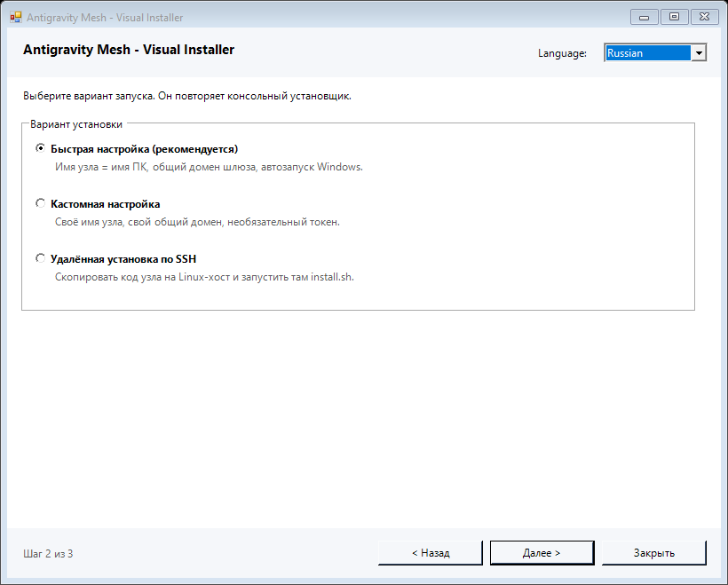
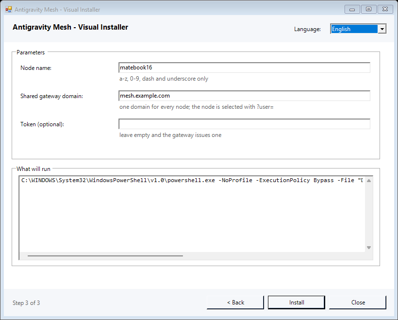
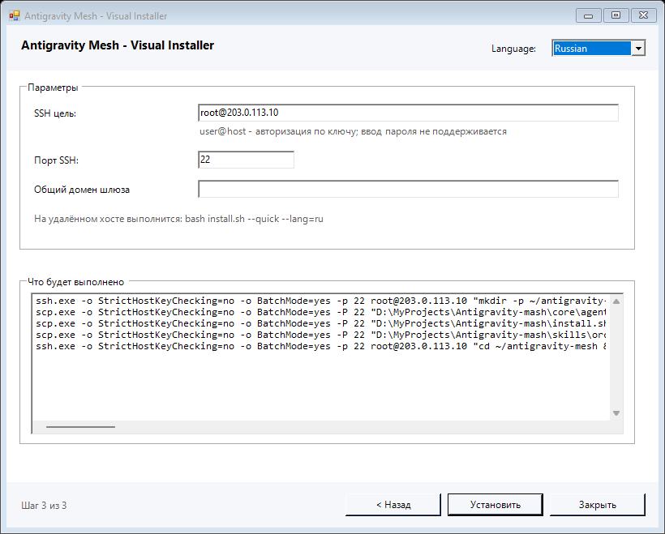
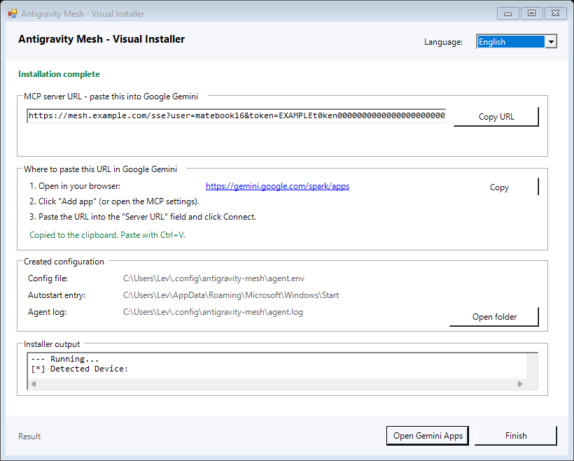

# Визуальный установщик для Windows

Настольный мастер установки Antigravity Mesh: то же, что делает консольный
`install.ps1`, но с окном, выбором варианта установки, переключением языка и
готовой ссылкой MCP в конце.


---

## 1. Запуск

Двойной щелчок по `install-gui.cmd` — или из терминала:

```powershell
.\install-gui.cmd
powershell -NoProfile -ExecutionPolicy Bypass -Sta -File .\install-gui.ps1
.\install-gui.ps1 -Lang ru          # начать на русском
.\install-gui.ps1 -SelfTest         # самопроверка без окна
```

### Язык

Мастер стартует на языке, который берётся из ваших языковых настроек Windows — в
таком порядке:

1. язык интерфейса Windows (`HKCU\Control Panel\Desktop\PreferredUILanguages`);
2. список предпочитаемых языков из «Параметры → Время и язык»
   (`HKCU\Control Panel\International\User Profile\Languages`);
3. `Get-WinUserLanguageList` — только если в реестре ничего не оказалось;
4. культура процесса, язык установки ОС и региональный формат — как последний
   довод.

Берётся первый язык из списка, который мастер умеет (`ru` или `en`); если ни
одного — английский.

**Почему не по `CurrentUICulture`.** На машине, где это писали, Windows русская:
`PreferredUILanguages` = `ru-RU`, `InstalledUICulture` = `ru-RU`,
`CurrentCulture` = `ru-RU`, `Get-WinSystemLocale` = `ru-RU`. При этом сам процесс
сообщает `CurrentUICulture` = `en-US`. Проверка только по культуре процесса
открывала мастер на английском — поэтому реестр читается первым.

Переключить язык можно в любой момент в шапке окна: подписи, кнопки и текст
страниц обновляются сразу, ничего не перезапускается. Флаг `-Lang ru` (или
`-Lang en`) задаёт язык принудительно и переопределяет автоопределение.

`-Sta` в лаунчере обязателен: ссылка MCP кладётся в буфер обмена, а буферу нужен
однопоточный апартамент.

### Готовый .exe

Если клонировать репозиторий не хочется, в релизе лежит один собранный файл —
`AntigravityMesh-Setup-<версия>.exe`:

```powershell
.\AntigravityMesh-Setup-0.2.6.exe            # открыть мастер
.\AntigravityMesh-Setup-0.2.6.exe -Lang ru   # начать на русском
.\AntigravityMesh-Setup-0.2.6.exe -SelfTest  # самопроверка без окна, печатает JSON
.\AntigravityMesh-Setup-0.2.6.exe --where    # куда распаковывается и почему
.\AntigravityMesh-Setup-0.2.6.exe --help     # краткая справка
```

Это лаунчер, а не переписанный мастер: внутрь упакован один zip с мастером,
`install.ps1`, `core/` и `install.sh`. При запуске он распаковывает их в
`%LOCALAPPDATA%\AntigravityMesh\setup\<версия>` и запускает `install-gui.ps1` оттуда —
поэтому логика установки остаётся ровно одна, и режим SSH получает свои `core/` и
`install.sh`.

* Папку распаковки можно задать переменной `MESH_SETUP_DIR`.
* Если `%LOCALAPPDATA%\AntigravityMesh` недоступна для записи, лаунчер **проверяет
  кандидатов настоящей записью** и переходит к следующему: сначала `%TEMP%`, затем
  папка рядом с самим файлом. Причина отказа каждой папки видна в `--where`.
  Проверка не лишняя: `Directory.CreateDirectory` для уже существующей папки
  возвращает успех даже без прав на запись, и отказ всплыл бы позже — на первом же
  файле, который создаёт установщик.
* Нужны только .NET Framework 4.x и PowerShell 5.1 — оба уже есть в Windows.
* Собирается из этого же репозитория: `.\build-installer-exe.ps1`. Используется
  встроенный в Windows компилятор C# (`csc.exe`) и `Compress-Archive`, поэтому ни SDK,
  ни NuGet, ни сеть не нужны.
* Мастер держит служебные файлы (вывод установщика, пробы самопроверки) в папке,
  которую **проверил на запись**: сначала `%TEMP%`, затем `runtime` рядом с грузом.
  Если `%TEMP%` недоступен, предполётная проверка раньше не давала вывода вообще, и
  первый экран сообщал про ненастроенный домен вместо того, что проверка не
  выполнилась. Теперь он говорит именно это, а запасная папка позволяет проверке
  всё равно пройти.
* Файл **не подписан** — SmartScreen при первом запуске может попросить подтверждение.
* Если мастер запущен из терминала, его вывод (`-SelfTest`, ошибки) идёт в этот
  терминал; при двойном щелчке ошибка показывается окном.

Сборка проверяется тестом: `tests/test_installer_gui.py::test_setup_exe_runs_the_wizard_self_test`
собирает `.exe`, запускает через него самопроверку мастера и проверяет, что
распакованный груз не повреждён.

### Что должно лежать рядом

Мастер не является самостоятельным файлом. Ему нужны:

| Файл | Зачем |
| :--- | :--- |
| `install.ps1` | вся логика установки: регистрация узла, автозапуск, ссылка |
| `install.sh`, `core/`, `skills/` | только для варианта «удалённая установка по SSH» |
| `install-gui.strings.json` | все тексты интерфейса, UTF-8 |

Поэтому мастер запускают из клона репозитория или из распакованного релиза, а не
одной строкой через `irm … | iex`.

---

## 2. Варианты установки

Мастер повторяет варианты консольных установщиков и **не переписывает их
логику**: он собирает параметры и вызывает `install.ps1` с ними.

| Вариант в мастере | Что произойдёт | Соответствие консоли |
| :--- | :--- | :--- |
| **Быстрая настройка** (рекомендуется) | имя узла = имя ПК, общий домен из окружения, автозапуск Windows | `install.ps1` без параметров; пункт 1 меню `install.sh` |
| **Кастомная настройка** | своё имя узла, свой общий домен, необязательный токен | `install.ps1 -Mode tunnel -User <имя> -Gateway <домен> [-Token <токен>]`; пункт 3 меню `install.sh` |
| **Удалённая установка по SSH** | код узла копируется на Linux-хост, там запускается `install.sh --quick` | `install.sh --ssh=user@host[:порт]` |



Локальный режим `standalone` (только `localhost`, без облачного шлюза) в окне не
вынесен: он остаётся доступен консольно через
`.\install.ps1 -Mode standalone -Port 8096`.

### Кастомная настройка



Внизу страницы всегда показана **точная команда**, которая будет выполнена, — это
и есть тот самый вызов `install.ps1`.

### Удалённая установка по SSH



Мастер выполняет ту же последовательность, что и ветка `--ssh` в `install.sh`:
создаёт `~/antigravity-mesh/{core,skills}`, копирует `core/*.py`, `install.sh` и
`skills/*`, затем запускает на удалённом хосте
`bash install.sh --quick --lang=<язык>`.

Требования и отличия:

* нужен компонент Windows **«Клиент OpenSSH»** (`ssh.exe`, `scp.exe`);
* вход только **по ключу**: `ssh` запускается с `BatchMode=yes`, поэтому запрос
  пароля не поддерживается — интерактивного ввода в окне нет;
* `__pycache__` не копируется: `.pyc` от другого интерпретатора на той стороне
  бесполезен;
* необязательное поле «Общий домен шлюза» передаётся удалённому `install.sh` как
  `--domain=`; если оставить пустым, домен разрешит сам `install.sh` (рядом с ним
  едет `core/domain.py`).

---

## 3. Предполётная проверка

На первом экране мастер один раз запускает `install.ps1 -DryRun -Lang <язык>` и
показывает результат: найденный интерпретатор Python, наличие `websockets`,
разрешённый домен шлюза, каталог конфигурации и путь автозапуска.


Это настоящая проверка, а не надпись: `-DryRun` в `install.ps1` ничего не меняет
в системе. Код возврата 2 означает «проверка нашла проблемы» — отчёт всё равно
показывается, а установку можно попробовать.

---

## 4. Ссылка MCP после установки



В конце мастер показывает ту же ссылку и ту же инструкцию, что и консольный
установщик:

```
https://<общий-домен>/sse?user=<имя-узла>&token=<токен>
```

* ссылку можно скопировать кнопкой (она же сразу лежит в буфере обмена);
* адрес в пункте 1 инструкции — **настоящая ссылка**: щелчок открывает
  `https://gemini.google.com/spark/apps` в браузере, а кнопка рядом кладёт её в
  буфер обмена;
* кнопка **Open Gemini Apps** внизу открывает ту же страницу;
* показаны пути `agent.env`, файла автозапуска и журнала агента, а кнопка
  **Открыть папку** открывает каталог конфигурации;
* ниже — полный вывод установщика, чтобы причину сбоя было видно, не закрывая окно.

Откуда берётся ссылка: сначала она читается из вывода `install.ps1` (тот печатает
её в рамке). Если строку прочитать не удалось, мастер собирает канонический адрес
из `agent.env` — `https://<MESH_GATEWAY>/sse?user=<MESH_USER>&token=<MESH_TOKEN>`.
Это не догадка: ровно такой же адрес возвращает шлюз в поле `sse_url`
(см. `tests/test_gateway_url_contract.py`).

При ошибке установки показывается отдельная страница с подсказкой: чаще всего
причина в домене, который не разрешается, — тогда нужно повторить запуск в режиме
«Кастомная настройка» с явным доменом.

---

## 5. Почему исходник только из ASCII

`install-gui.ps1` **не содержит ни одного символа вне ASCII** — намеренно.
Windows PowerShell 5.1 читает скрипт без метки UTF-8 в ANSI-кодировке, русский
текст превращается в символы, которые парсер считает закрывающими кавычками, и
файл перестаёт разбираться целиком. Именно поэтому `install.ps1` носит метку BOM
и именно поэтому её нельзя «нормализовать» (см. `docs/WINDOWS_TESTING.md`).

Мастер обходит эту ловушку иначе: все тексты лежат в `install-gui.strings.json`,
который читается явно как UTF-8. Отсюда два следствия:

* файл разбирается при любой кодировке сохранения, и метка ему не нужна;
* переключение языка — это правка данных, а не кода: чтобы добавить язык, надо
  добавить блок в JSON, трогать скрипт не нужно.

Свойство «только ASCII» проверяется в самопроверке и в тестах, чтобы его не
потеряли при следующей правке.

---

## 6. Файлы

| Файл | Назначение |
| :--- | :--- |
| `install-gui.ps1` | окно мастера (WinForms, только ASCII, PowerShell 5.1) |
| `install-gui.strings.json` | тексты интерфейса, UTF-8, блоки `en` и `ru` |
| `install-gui.cmd` | запуск двойным щелчком (`-Sta`, `-ExecutionPolicy Bypass`) |
| `tests/test_installer_gui.py` | проверки: ASCII, разбор в PS 5.1, паритет языков, самопроверка |

---

## 7. Проверка

```powershell
# самопроверка мастера: все страницы на двух языках, конвейер процессов,
# разбор ссылки и разбор предполётного отчёта
.\install-gui.ps1 -SelfTest

# тесты проекта
.\run_tests_windows.ps1 -- tests/test_installer_gui.py -v
```

`-SelfTest` собирает каждую страницу в каждом языке и в каждом варианте, реально
запускает внешний процесс и проверяет, что вывод перехвачен, а код возврата
различён, и разбирает образец вывода `install.ps1`. Окно при этом не открывается.

---

## 8. Что стоит знать

* **Мастер вызывает `install.ps1`, а не повторяет его.** Регистрация на шлюзе,
  проверка пустого токена, запись автозапуска и контракт общей ссылки живут в
  одном месте, поэтому визуальный и консольный установщики не могут разойтись.
* **Запуск процесса устроен неочевидно.** Вывод перенаправляется в файлы силами
  `cmd.exe`, а процесс создаётся через `ProcessStartInfo`. Причина измерена:
  `Start-Process -RedirectStandardOutput -PassThru` возвращает объект, у которого
  `ExitCode` пуст, — установщик, не отличающий успех от сбоя, бесполезен.
  Поэтому мастер не использует `Start-Process` с перенаправлением.
* **Разметка — абсолютные пиксели**, и `AutoScaleMode` выставлен в `None`, чтобы
  автоматическое масштабирование по шрифту не сдвигало колонки на машинах с
  другим шрифтом по умолчанию. Окно можно растянуть: кнопки прижаты к правому краю.
* **Отмена.** Пока идёт установка, закрытие окна спрашивает подтверждение и
  завершает дерево процессов (`taskkill /T`), чтобы не оставить работающий агент.
