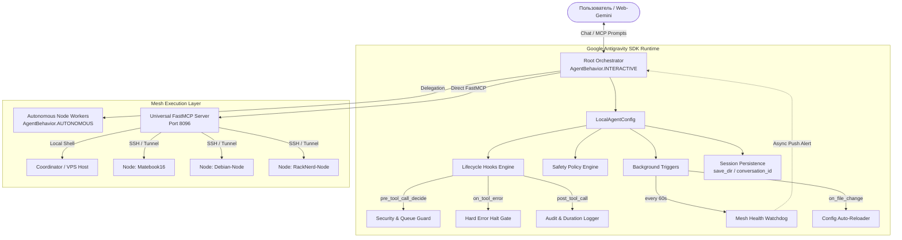

# Спецификация: Интеграция Google Antigravity SDK в Antigravity Mesh (v2.0)

- **Дата:** 2026-09-06
- **Статус:** Готово к внедрению (Approved)
- **Методология:** Superpowers Spec-Driven Development
- **Целевые компоненты:** `core/agent_harness.py`, `core/hooks.py`, `core/triggers.py`, `core/schemas.py`, `core/policies.py`, `core/server.py`

---

## 1. Концепция и цели системы

### 1.1. Проблема
В текущей реализации оркестратора Antigravity Mesh правила надёжности (Шлюз проверки логов, запрет очередей Google Диска, немедленный откат при ошибках) опираются на текстовые директивы в системном промпте (`GEMINI.md` и `SKILL.md`).
Это создаёт риски:
1. Человеческий фактор модели: возможны спекулятивные продолжения при ошибках инструментов.
2. Пассивность: агент не знает о деградации или падении удалённых узлов, пока пользователь явно не запустит проверку.
3. Неструктурированные данные: парсинг вывода системных метрик через текст/regex приводит к сбоям.
4. Отсутствие аппаратных барьеров безопасности: случайное выполнение деструктивных команд предотвращается только инструкциями.

### 1.2. Решение
Интеграция официального **Google Antigravity SDK** (`google-antigravity`) в качестве ядра рантайма оркестратора.
Перевод ключевых инвариантов из текстовых промптов в **рантайм-механизмы SDK**:
- Аппаратные хуки жизненного цикла (`@hooks.on_tool_error`, `@hooks.pre_tool_call_decide`, `@hooks.post_tool_call`).
- Фоновые вотчдог-триггеры (`every(60, check_vitals)`).
- Строгая типизация через схемы Pydantic (`response_schema`).
- Декларативные предикатные политики безопасности (`google.antigravity.hooks.policy`).
- Иерархические субагенты с изоляцией контекста.
- Персистентность сессий и раздельный мониторинг токенов размышлений (`BudgetConfig`).

---

## 2. Архитектура решения



---

## 3. Спецификация компонентов

### 3.1. Типизированные схемы данных (`core/schemas.py`)
Все интерфейсы и результаты работы валидируются через Pydantic v2:

```python
from pydantic import BaseModel, Field
from typing import Optional, List
from datetime import datetime

class NodeVitals(BaseModel):
    hostname: str
    ip: str
    is_online: bool
    cpu_load_1m: float
    ram_used_mb: int
    ram_total_mb: int
    ram_usage_pct: float
    disk_free_gb: float
    disk_total_gb: float
    uptime: str
    timestamp: datetime = Field(default_factory=datetime.utcnow)

class ToolExecutionResult(BaseModel):
    command: str
    target_node: str
    exit_code: int
    duration_seconds: float
    stdout: str
    stderr: Optional[str] = None
    is_error: bool
    error_summary: Optional[str] = None

class MeshHealthSnapshot(BaseModel):
    overall_healthy: bool
    healthy_node_count: int
    total_node_count: int
    nodes: List[NodeVitals]
    warnings: List[str] = []
    timestamp: datetime = Field(default_factory=datetime.utcnow)

class TaskDispatchPlan(BaseModel):
    task_id: str
    title: str
    target_nodes: List[str]
    ordered_steps: List[str]
    rollback_steps: List[str]
    dry_run_verified: bool = False
```

### 3.2. Хуки жизненного цикла (`core/hooks.py`)
Обеспечивают аппаратное исполнение правил проекта:

1. **`pre_tool_call_decide`**:
   - Проверяет команду на запрещённые паттерны: попытки создания `antigravity_tasks.json`, прямой вызов SSH без обёртки, деструктивные операции над корневой системой (`rm -rf /`, `mkfs`, `dd`).
   - Возвращает `HookResult(allow=False, reason=...)` при обнаружении нарушения, предотвращая выполнение ДО его начала.

2. **`on_tool_error`**:
   - Перехватывает любые сбои (`exit_code != 0`, тайм-ауты, обрывы сети).
   - Выполняет немедленный **Hard Error Halt**: возвращает в контекст модели детерминированное системное сообщение об остановке с требованием доложить пользователю и не выполнять последующие шаги без явной команды.

3. **`post_tool_call`**:
   - Фиксирует длительность и метаданные выполнения.
   - Ведёт кольцевой буфер телеметрии в `live_logs/mcp_audit.jsonl`.

### 3.3. Проактивные триггеры (`core/triggers.py`)
1. **`MeshWatchdogTrigger` (`every(60, check_mesh_vitals)`)**:
   - Каждые 60 секунд запрашивает статус всех зарегистрированных узлов.
   - При обнаружении падения узла или превышения порогов (RAM > 90%, Load > cores * 2):
     Асинхронно пушит в контекст агента через `ctx.send(...)`:
     `[WATCHDOG ALERT] Узел <hostname> превысил критический порог памяти (94%). Рекомендуется провести диагностику.`
2. **`ConfigChangeTrigger` (`on_file_change`)**:
   - Отслеживает изменения `server_facts.json` и `server_profile.md`.
   - При изменении перечитывает конфигурацию узлов без перезапуска процесса.

### 3.4. Политики безопасности (`core/policies.py`)
9-уровневая система доступа SDK:
- `policy.workspace_only(["/root/agy-gdrive-runner", "/home/lev/MyProjects/antigravity-mesh"])`: блокирует запись в неразрешённые системные каталоги.
- `policy.allow("run_command", when=is_safe_command)`: безопасные команды выполняются без подтверждения.
- `policy.ask_user("run_command", when=is_sensitive_command)`: деструктивные команды (остановка ключевых демонов, удаление данных) требуют интерактивного подтверждения.
- `policy.deny("run_command", when=contains_drive_queue)`: полное аппаратное блокирование создания очередей на Диске.
- `policy.allow(mcp_server_config)`: все нативные инструменты FastMCP разрешены.

### 3.5. Иерархия субагентов (`core/subagents.py`)
- **Root Orchestrator**: `AgentBehavior.INTERACTIVE`, координирует работу, задаёт вопросы через `ask_question`, владеет глобальным планом.
- **Node Autonomous Workers**:
  - `coordinator_worker`: `AgentBehavior.AUTONOMOUS`, инструменты: `bash_exec`, `view_file`, `edit_file`.
  - `remote_node_worker`: `AgentBehavior.AUTONOMOUS`, инструменты: `<node>_exec`, `<node>_vitals`.
  - `code_researcher`: `AgentBehavior.AUTONOMOUS`, инструменты: `view_file`, `search_directory` (только чтение).
- Лимиты: `max_subagent_depth = 2`, `allowed_subagents = ["coordinator_worker", "remote_node_worker", "code_researcher"]`.

### 3.6. Персистентность и бюджеты (`core/agent_harness.py`)
- `save_dir = "/root/agy-gdrive-runner/.state/sessions"`: сохранение траекторий диалогов.
- `app_data_dir = "/root/agy-gdrive-runner/.state/artifacts"`: сохранение артефактов и логов.
- `BudgetConfig(max_model_calls=30, max_tool_calls=60, max_total_tokens=200_000)`: защита от зацикливания.
- Мониторинг `thoughts_token_count` для контроля расхода токенов размышлений.

---

## 4. Контракты интерфейсов (API & File Layout)

### Файловая структура:
```
antigravity-mesh/
├── core/
│   ├── __init__.py
│   ├── schemas.py           # Pydantic v2 модели
│   ├── hooks.py             # Рантайм-хуки (on_tool_error, pre_tool_call_decide)
│   ├── triggers.py          # Watchdog-триггеры (every, on_file_change)
│   ├── policies.py          # Политики безопасности с предикатами
│   ├── subagents.py         # Конфигурации субагентов (SubagentConfig)
│   ├── agent_harness.py     # Инициализатор LocalAgentConfig и сессий
│   ├── server.py            # FastMCP сервер с валидацией Pydantic
│   └── vitals.py            # Сбор метрик хостов
├── tests/
│   ├── test_schemas.py      # Валидация Pydantic контрактов
│   ├── test_hooks.py        # Тестирование отсечки ошибок и запрета очередей
│   ├── test_triggers.py     # Тестирование периодического вотчдога
│   ├── test_policies.py     # Тестирование матриц доступа и предикатов
│   └── test_harness.py      # Дымовой тест интеграции с SDK
```

---

## 5. Граничные случаи и отказоустойчивость (Failure Modes)

1. **Недоступность удалённого узла (SSH Timeout / Host Down):**
   - Инструмент возвращает `exit_code: -1`, `is_error: True`.
   - `on_tool_error` перехватывает событие до того, как модель продолжит галлюцинировать.
   - Срабатывает `Hard Error Halt`: в лог пишется инцидент, выполнение плана замораживается, пользователю выдаётся отчёт с точной ошибкой.

2. **Попытка модели создать `antigravity_tasks.json`:**
   - `pre_tool_call_decide` отсекает вызов инструмента с кодом `403 Forbidden` и причиной `Zero Drive Queue Policy Violation`.
   - Модель не может обойти запрет, так как проверка происходит в нативном Python-рантайме SDK.

3. **Сжатие контекста диалога (Context Compaction):**
   - Хук `on_compaction` сериализует текущее состояние mesh-сети (`MeshHealthSnapshot`) в локальный файл `.state/latest_mesh_state.json`.
   - При старте следующего хода состояние мгновенно восстанавливается без потери контекста.
